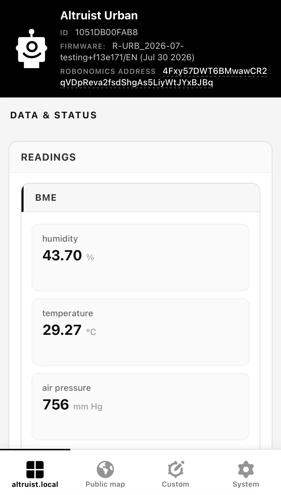
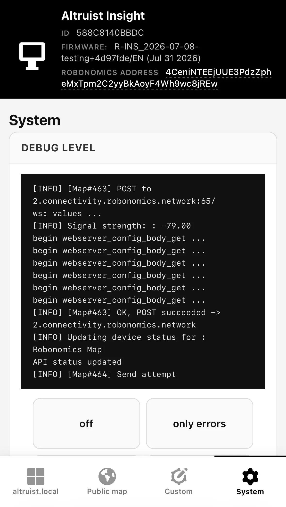
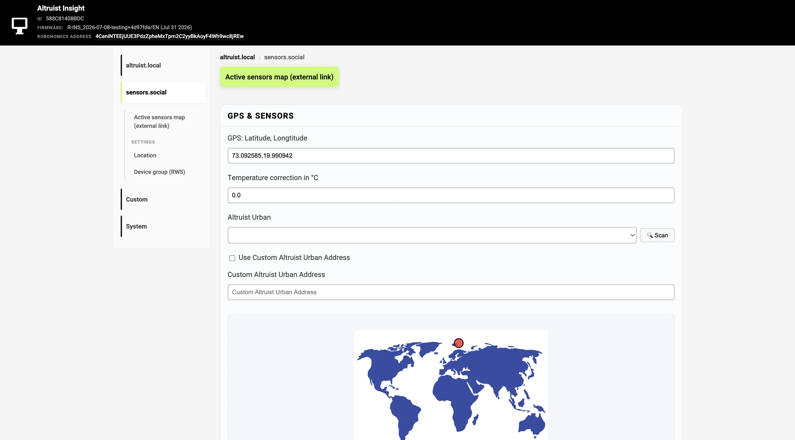
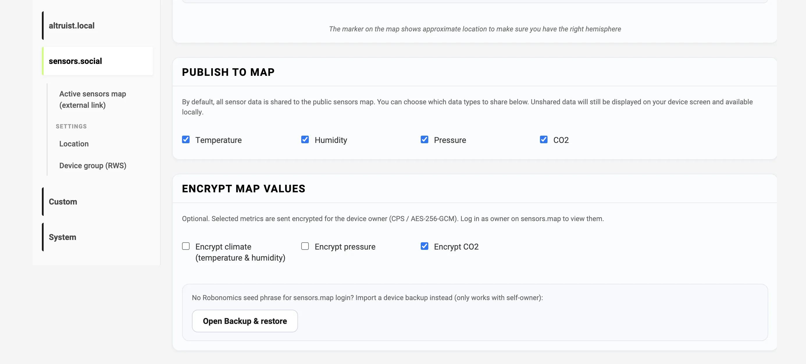
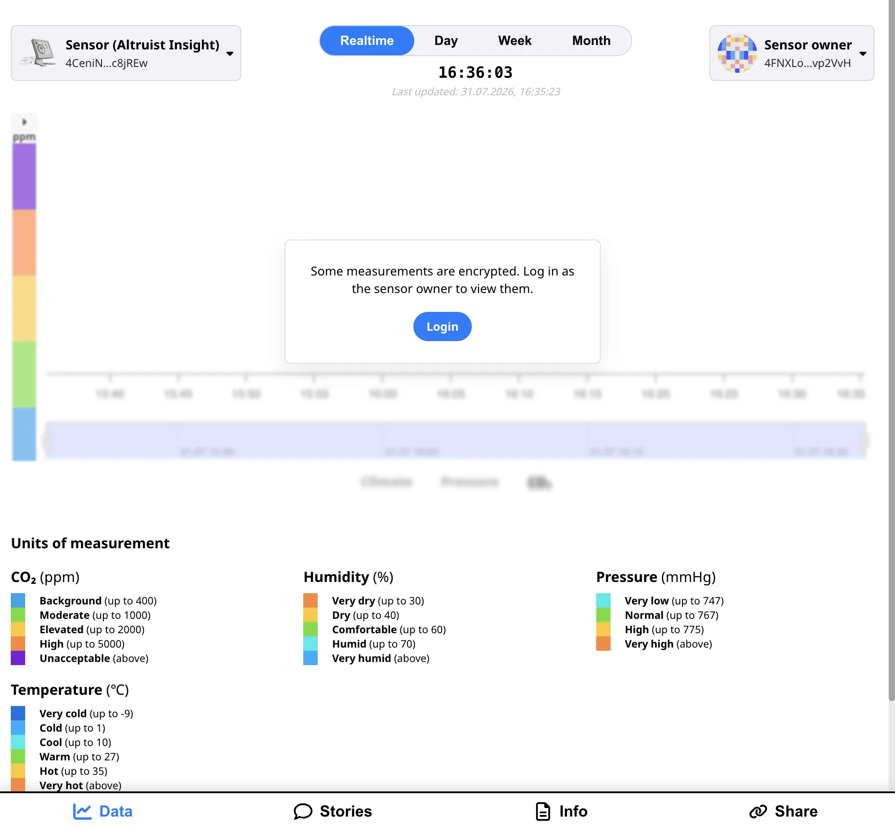
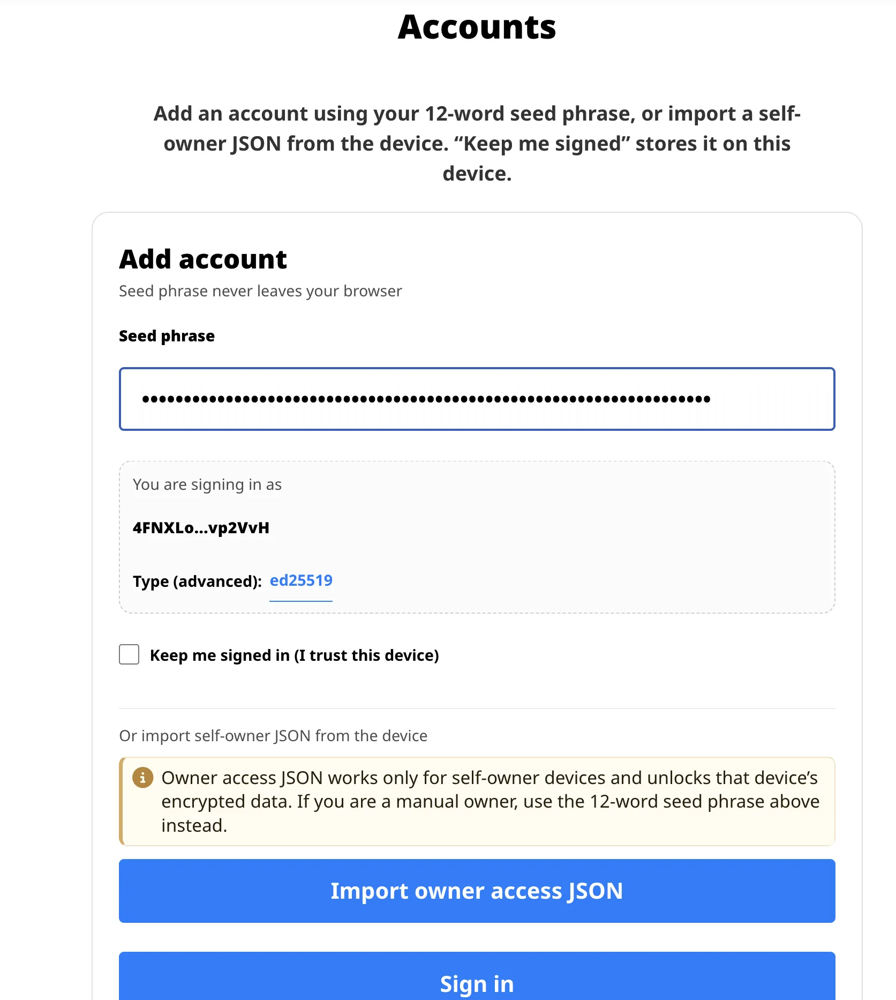
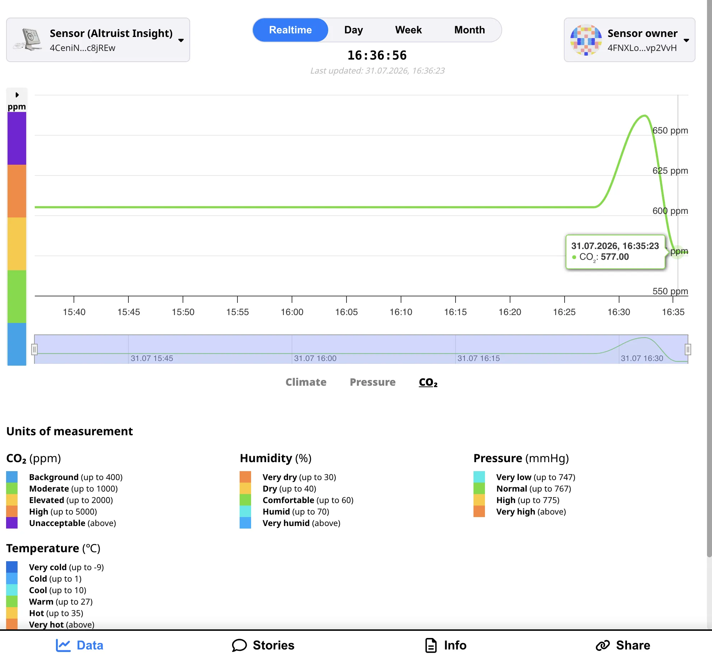
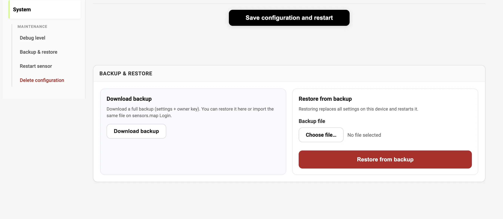

## New web interface

The device UI will feel closer to a mobile app. Four areas:

| Tab                | Purpose                             |
| ------------------ | ----------------------------------- |
| **altruist.local** | Readings and device settings        |
| **sensors.social** | Map / Robonomics related settings   |
| **Custom**         | Home Assistant, API, InfluxDB, CSV  |
| **System**         | Debug, restart, backup, wipe config |

Desktop gets a sidebar; phones get bottom tabs. The captive portal for first-time Wi‑Fi setup stays familiar, with clearer steps (1 → 2 → Finish setup) and inline hints.

---

## Encrypting values on the map

The [sensors.social](https://sensors.social) map is open by design: anyone can see what a sensor reports. For many readings that’s exactly the point — air is shared. Sometimes, though, you’d rather keep a few values to yourself: bedroom temperature, co2, anything you don’t want on a public pin.

The new firmware will let you choose which metrics to encrypt before they leave the device. Outwardly, a number becomes a sealed string — unreadable without your key. Neighbors still see what you leave open; encrypted fields open only for you.

In practice it looks like this. In device settings you turn on encryption for the metrics you care about. The sensor seals them so only the **owner** can unlock them — usually the device itself, or the account you use to log in on the map. On [sensors.social](https://sensors.social) you sign in with your seed phrase or import a backup, and those sealed fields become ordinary numbers again.

If the owner is set manually to a different address (not the device’s own key), you’ll need that key to decrypt on the map. A regular device backup still restores settings, but it won’t unlock ciphertext meant for someone else’s owner key.

The format follows [Robonomics CPS](https://github.com/airalab/robonomics/tree/master/frame/cps#-encryption-format): device and owner agree on a shared secret without sending it over the network, derive an AES key, and ship the value as `e.…`. More in the [format notes](https://github.com/airalab/robonomics/tree/master/frame/cps#-encryption-format) and [how encryption works](https://github.com/airalab/robonomics/tree/master/frame/cps#how-encryption-works).

---

## Backup and restore

Your Altruist keeps more than Wi‑Fi credentials: coordinates, sharing options, and its Robonomics device identity (the address that ties readings to _you_ on the map). Lose the config, and you’re starting from scratch.

That’s why backup becomes a first-class screen in the new firmware, not a hidden export.

**System → Backup & restore** will export a full settings backup (including the owner key when present). Restore replaces config and reboots. The same file can be used for map login — one export for restoring the device and unlocking your data on the map.

On guest Wi‑Fi, restore will be available **before** joining the home network — handy after a reset, while the sensor is still in first-time setup.

---

## And more

- Unique hostnames: `altruist-insight-<id>` / `altruist-urban-<id>`
- More reliable config save after Wi‑Fi setup
- Datalog and Map signing that handle long encrypted fields

---

When the build ships, we’ll post again with updates. Stay tuned on sensors.social!
