We [previewed the next Altruist firmware](/blog/altruist-firmware-hub-and-encryption)
a few days ago: an app-like web interface, optional encryption of map values,
backup and restore. It is now available on the Testing channel, and this post is
the practical half — we took a working Urban off the shelf, flashed Testing onto
it, connected it to Wi-Fi and walked through every screen.

If you want to try it too, this is the whole path. If you don't, the short
version is: your Altruist updates itself on Stable and you never need to touch a
cable.

## When flashing by hand makes sense

Devices on the Stable channel pull firmware over the air on their own. Manual
flashing exists for three cases: you want the Testing build early, you want to
go back to Stable after testing, or something is broken badly enough that OTA
cannot run. Testing means what it says — these builds carry changes that have
not finished long-term validation. You will find rough edges. Telling us about
them is the point.

## What you need before you start

- **A desktop computer with Chrome or Edge.** The installer talks to the sensor
  through the Web Serial API, and the page refuses every other browser. This
  cannot be done from a phone — worth knowing before you carry the sensor to
  the kitchen table.
- **A USB-C data cable.** Charge-only cables show nothing at all.
- **Which module and which chip you have.** Urban exists on ESP32-C6 (current)
  and ESP32-C3 (legacy); Insight is C6 only. The installer asks.

## Picking the build

Open [webflasher.robonomics.network](https://webflasher.robonomics.network/).
The EN/RU switch at the top is not only interface language — it also selects
which firmware you are offered, English or Russian.

Choose the firmware (`Urban Testing` in our case), then the chip. The chip list
appears only after the firmware is chosen, because it depends on the build. Once
both are set, the Connect button turns green.

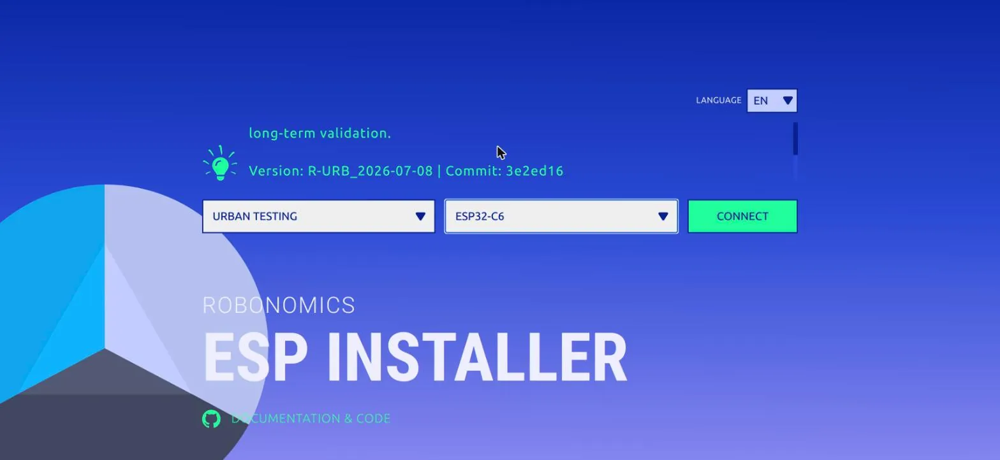

Scroll the description block above the selects and it tells you exactly what you
are about to install — in our case `Version: R-URB_2026-07-08 | Commit: 3e2ed16`,
with a warning that Testing builds have not completed long-term validation. Worth
a glance: it is the difference between "I installed the new firmware" and "I
installed commit 3e2ed16", and only the second is useful in a bug report.

Click **Connect** and pick the sensor's serial port in the browser dialog. The
installer then tells you what is running on the device right now, for example
`Altruist Altruist-Urban (R-URB_2026-06.1-testing+35859af)`. Write that down
before you overwrite it.

## The one checkbox that matters

Choose **Install**, and the installer asks whether to erase the device first.

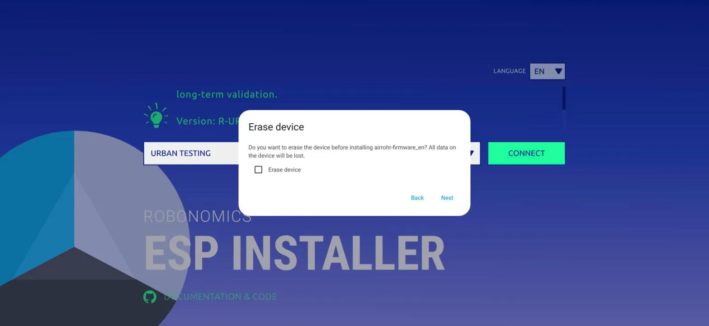

**Leave "Erase device" unchecked.** Erasing wipes everything stored on the
device, and that includes its Robonomics identity — the key pair that makes this
sensor *this* sensor on the map. Erase it and your device comes back as a
stranger, with its measurement history stranded under the old address. Tick that
box only if you are deliberately doing a factory reset.

The next dialog names the build, and then it runs.

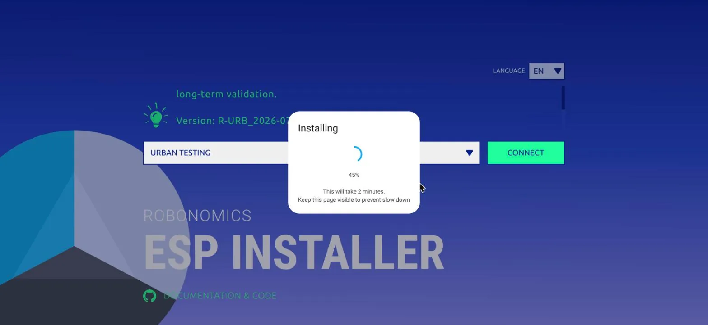

The dialog says it will take two minutes. Ours finished in about twenty seconds.
The "keep this page visible" note is real, though: a backgrounded tab gets
throttled by the browser, and the transfer slows down with it.

## What survives the update

This is the question everyone asks first, so we checked it against the device's
own boot log rather than guessing. With **Erase device unchecked**, the sensor
comes back up, mounts its filesystem, parses the existing config, and reports
the same Robonomics address and the same saved Wi-Fi credentials as before. The
publishing intervals are unchanged too — a reading every 30 seconds to the map,
a signed datalog every 10 minutes.

In short: you do not have to set the device up again. If your current firmware
already has **System → Backup & restore**, take a backup first anyway — it costs
nothing and it is the only thing that helps if something does go wrong.

## Connecting to Wi-Fi from the installer

The installer can put the sensor on your network directly, without the captive
portal: **Connect to Wi-Fi** in its menu.

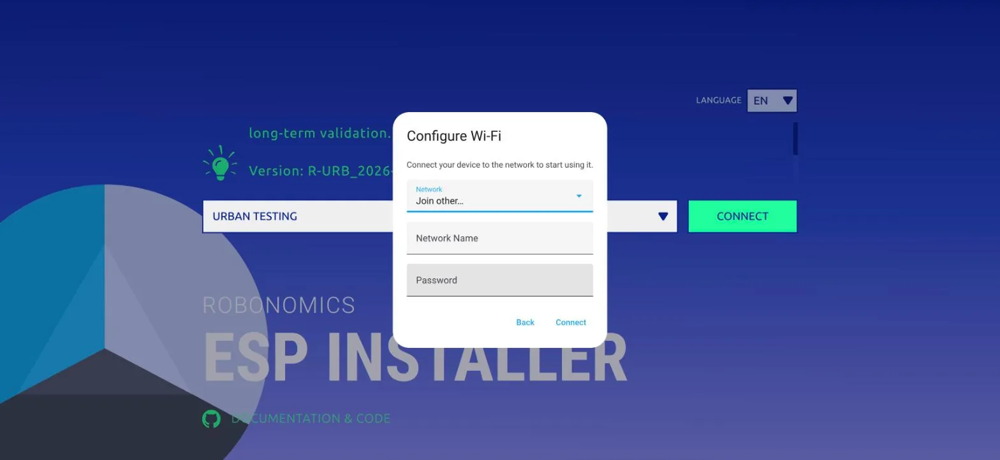

One thing to expect: our network list came back empty. That is what the
`Join other…` option is for — type the network name by hand, enter the password,
and it connects. Remember that the sensor only speaks 2.4 GHz.

After it reports success, open **Logs & Console** in the same menu: the boot log
prints the address the device received, `WiFi connected, IP is : …`. That is the
quickest way to find it — no router admin page required.

## The new interface, zone by zone

Open that IP in a browser and the app-like interface is there: a sidebar on
desktop, bottom tabs on a phone, four zones.

### Device readings and status

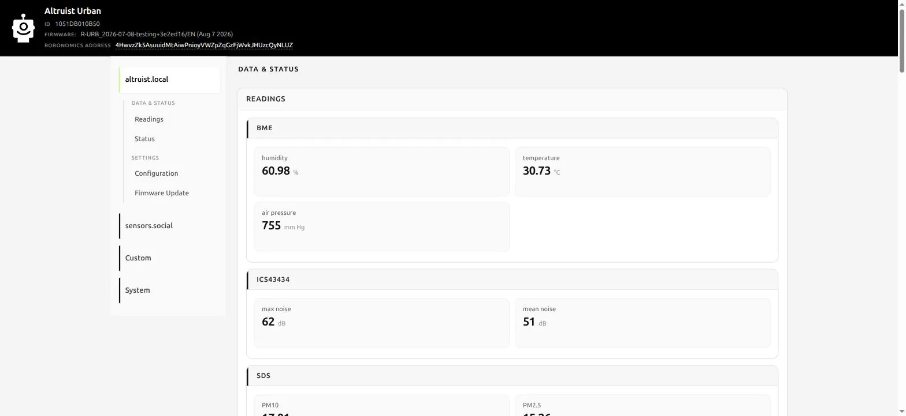

Live values grouped by sensor. Under **Status** you get the practical things:
uptime, IP address, reset reason, free memory, and a **Technical details** card —
firmware channel, source commit, device model, ESP target, build profile. It is
labelled "useful when contacting support", and it genuinely is: one screenshot of
that card answers the first five questions support would otherwise have to ask.

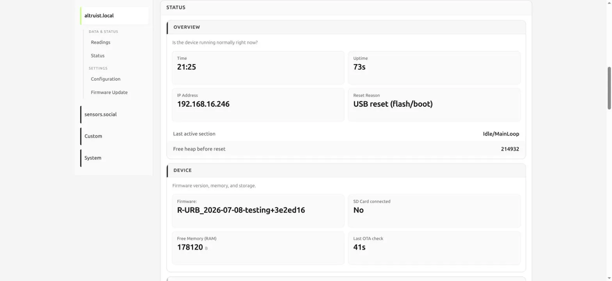

Below it, a panel that is new and worth understanding:

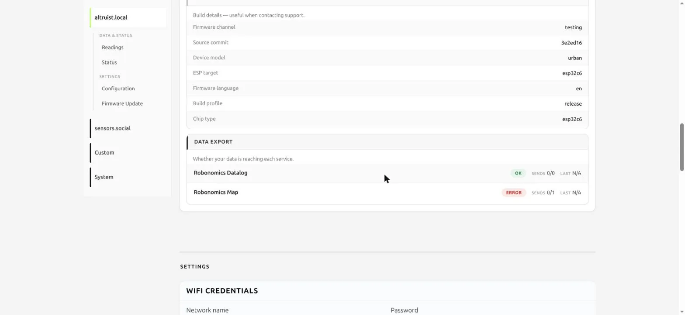

**Data export** shows whether your readings are reaching each service separately —
the Robonomics datalog and the map. Give it a few minutes after a reboot before
reading anything into it: a freshly restarted device has not attempted a datalog
yet, since those go out every ten minutes.

### The map zone

Everything related to [sensors.social](https://sensors.social) lives in its own
zone. Coordinates first:

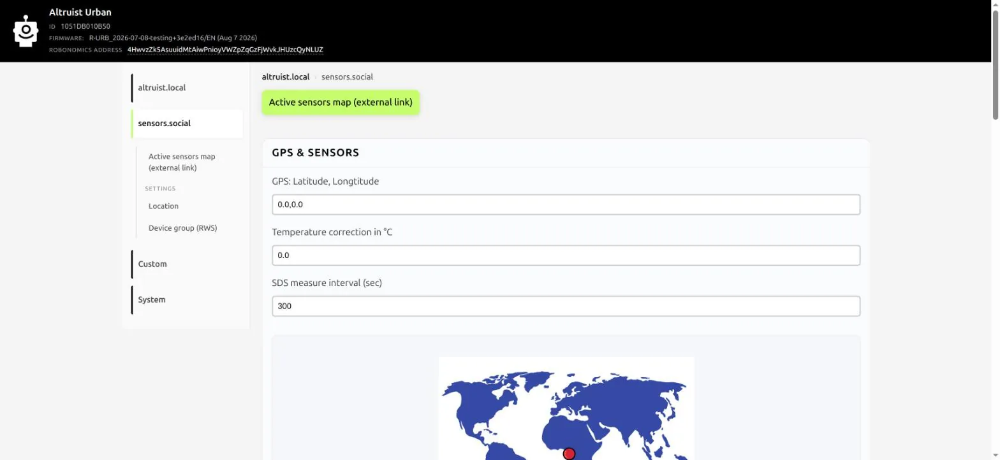

The little world map under the field is a nice touch — a red dot showing roughly
where your sensor claims to be, so a transposed latitude and longitude is
obvious before you save it. Note that the coordinates go into a **single field**
as `latitude,longitude`, and the decimal separator is a dot. If your keyboard
layout likes commas, check the dot on the map.

Then the part we are most curious to hear about:

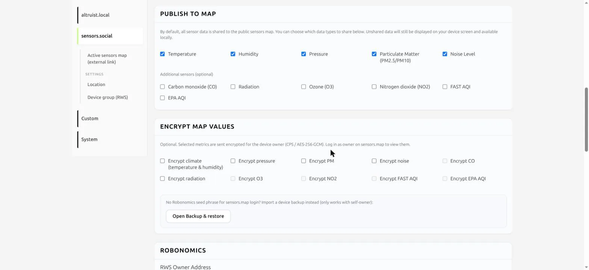

**Publish to map** lets you choose which data types go to the public map. What
you unshare still shows on your own device screen and stays available locally —
you are choosing what the world sees, not what you measure.

**Encrypt map values** goes further: the checked metrics leave the device
encrypted for the device owner, and become ordinary numbers again only when you
log in as that owner on the map. Two things to know before you turn it on. First,
encryption hides the readings, not the sensor: your location, the device address
and the send times stay public either way. Second, the owner matters —

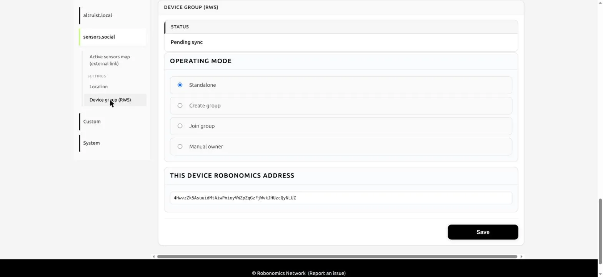

A **Standalone** device encrypts to itself, so its own backup opens the data.
**Create group** makes it the owner for other devices that join. **Join group**
means the group master's key opens your values — and yours does not. **Manual
owner** encrypts to whatever address you type, so type it carefully: if the
address is wrong, nobody can decrypt those readings, and a backup of the device
will not help. That last case is the one to be deliberate about.

### Custom integrations

The **Custom** zone holds the do-it-yourself paths: a custom API endpoint,
InfluxDB, CSV. They carry BETA and EXPERIMENTAL badges, which is honest labelling
— treat them as such. Home Assistant is not in this list because it does not
need to be: the integration discovers the device on its own.

### System

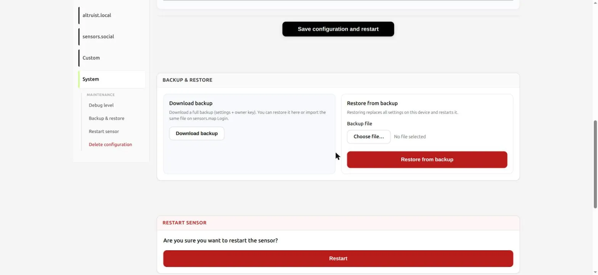

**Backup & restore** produces a full backup — settings plus the owner key — and
the same file can be used to log in on the map. Which means it is not a settings
file, it is a credential. Keep it where you keep passwords, and don't send it in
chats or email; support will never ask you for it.

And one screen to read slowly:

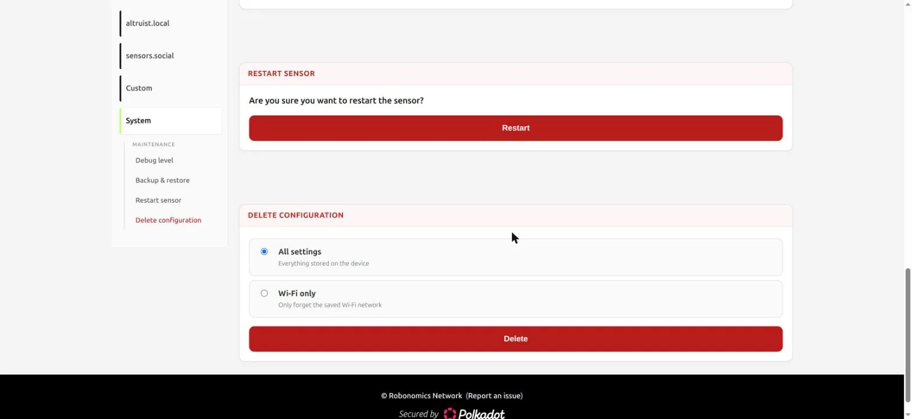

**Delete configuration** offers two very different things. `Wi-Fi only` forgets
the saved network and keeps the device's address and history — this is the one
you want when you change routers, and it is a genuine improvement over holding a
button for ten seconds. `All settings` erases everything stored on the device,
identity included. Note which one is preselected, and take a breath before
clicking the red button.

The same zone holds the live debug console and a plain **Restart**.

## Going back to Stable

Automatic OTA is pinned to Stable artifacts, and it is disabled in Testing
builds on purpose — so a Testing device will not quietly return to Stable on its
own. Coming back is deliberate: flash `Urban Stable` or `Insight Stable` in the
same installer, or trigger the manual `/ota` update.

## If Linux won't open the port

On Linux the port shows up in the browser dialog and then refuses to open:
`Failed to execute 'open' on 'SerialPort'`. Two causes, usually both at once.

Your account needs permission on the port — the device appears as
`/dev/ttyACM0`, owned by `root:dialout`:

```bash
sudo usermod -aG dialout $USER   # then newgrp dialout, or log out and back in
```

And ModemManager probes every new `ttyACM` device to see whether it is a modem,
holding the port for exactly the seconds you are trying to use it:

```bash
sudo systemctl stop ModemManager
```

To fix that permanently, tell it to ignore Espressif devices — `303a` is the
vendor id of the ESP32-C6's native USB:

```bash
printf 'SUBSYSTEM=="tty", ATTRS{idVendor}=="303a", ENV{ID_MM_DEVICE_IGNORE}="1"\n' \
  | sudo tee /etc/udev/rules.d/99-esp-no-modemmanager.rules
sudo udevadm control --reload
```

## Tell us what breaks

That is the whole loop: pick the build, keep Erase unchecked, install, reconnect
to Wi-Fi, look around. Twenty seconds of flashing and a device that kept
everything it had.

Testing exists so that problems surface here rather than on the sensors people
have already mounted on their balconies. If something in the new interface reads
wrong, behaves unexpectedly, or simply cannot be found where you looked for it —
that is exactly the report we want. Open an issue at
[github.com/airalab/altruist-firmware](https://github.com/airalab/altruist-firmware),
and mention the version and commit from the Technical details card.
