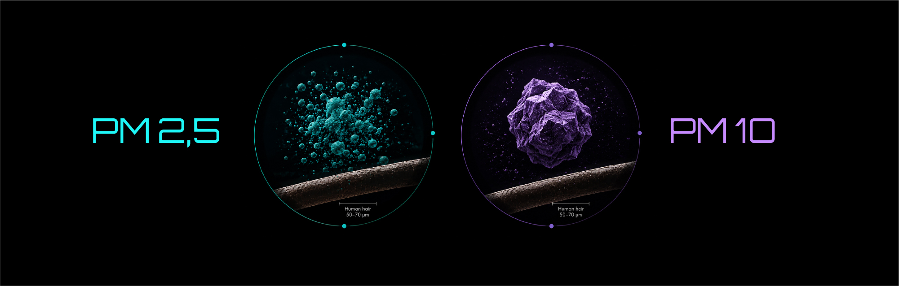
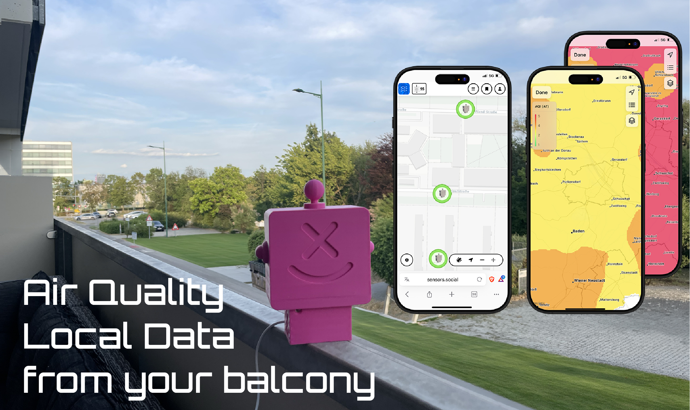

Official monitoring stations are essential for assessing air quality across a city or region. But an industrial city is not a uniform environment. Particle concentrations can differ near an industrial facility, in a residential neighborhood, along a busy road, or just a few kilometers away from an industrial zone. Even at the same location, conditions can change significantly depending on the time of day and the weather.

That’s why local measurements are especially valuable: they allow you to observe not the “average air quality of the city,” but the air exactly where you live. WHO also notes that its city-level air quality data are intended to represent the overall situation in a city or settlement rather than conditions at a specific monitoring location.

## What Can Affect Air Quality in an Industrial City?

Industry is far from the only source of particulate matter. Particle levels can be influenced simultaneously by industrial facilities and power plants, fuel combustion, traffic, heating, construction, road dust, and many other processes. Some particles are emitted directly into the air, while others form in the atmosphere through chemical reactions involving gaseous pollutants.

So, detecting high PM levels near a factory does not automatically prove that the factory is the source. A local monitor shows changes in particle concentrations, while accurately identifying their origin requires additional data and methods of analysis.

## What Should You Monitor: PM2.5 or PM10?

Both — they tell different parts of the story.

### PM2.5 — Especially Important Where Combustion Occurs

These are fine particles up to 2.5 micrometers in diameter. In industrial environments, elevated PM2.5 levels can be associated with fuel combustion, power generation, industrial processes, and transportation. A significant proportion of fine particles can also form secondarily in the atmosphere through chemical reactions involving gaseous pollutants. WHO and the EEA identify industry, energy production, and transport as important sources of PM2.5.

If you live near a power plant, metallurgical facility, or another industrial site where combustion processes take place, PM2.5 becomes particularly important for long-term monitoring.

From a health perspective, fine particles deserve particular attention. PM2.5 can penetrate deep into the lungs and enter the bloodstream, and long-term exposure to fine particulate matter is associated with significant health risks.

### PM10 — Especially Important Where Dust Is Present

If you live near quarries, cement plants, mineral extraction or processing facilities, bulk material storage sites, construction areas, unpaved roads, or locations with heavy machinery traffic, PM10 is particularly important to monitor.

Larger particles are often associated with mechanical processes such as mineral dust, road dust, mining, construction, and the resuspension of settled dust by wind or traffic. WHO also identifies road dust, agricultural dust, wind-blown dust, and dust from mining activities as common sources of larger particles.

However, there is no strict rule that “factory = PM2.5” and “quarry = PM10.” The same source can affect both particle fractions at the same time. That is why it is much more useful to monitor PM2.5 and PM10 together.

### The Most Interesting Part Isn’t a Single Peak — It’s the Pattern

Imagine that one evening your monitor shows a sudden rise in PM levels. On its own, that single peak tells you very little.

But if a similar increase appears every evening, regularly occurs on certain days, or coincides with a particular wind direction, it starts to reveal an interesting pattern.

**In an industrial city, it can be useful to observe:**

- what time of day the peaks occur;
- how long they last;
- whether they repeat on certain days of the week;
- whether weekdays differ from weekends;
- what happens with different wind directions;
- how readings change after rain or during dry weather;
- whether there are differences between winter and summer;
- whether PM2.5 and PM10 rise together, or one fraction increases more than the other.

## Wind Can Completely Change the Picture

Distance from an industrial area is only one factor.

Today, your home may be upwind of an industrial zone, and PM levels may remain relatively low. Tomorrow, the wind direction may change, and air masses may move very differently.

During light winds and temperature inversions, pollution may disperse less effectively and accumulate closer to the ground. Rain, on the other hand, can help remove some particles from the atmosphere. Strong winds can either disperse local pollution or lift large amounts of settled dust back into the air.

That’s why it is especially useful to compare PM measurement history with weather conditions, rather than looking at PM readings in isolation.

## A City Monitoring Station and Your Balcony Answer Different Question

An official monitoring network answers the question: **“What is happening with air quality across the city or region?”** A local monitor answers a different one: **“What is happening with the air around my home?”** These measurements do not compete with each other — they complement each other.

Altruist Urban allows you to measure PM2.5 and PM10 directly where you live, while sensors.social stores your measurement history and lets you track changes on graphs over different periods of time.

If you live in an industrial city, the most interesting insight is often not a single high reading, but a recurring pattern:

- When do the peaks occur?
- How long do they last?
- Which particle fraction increases more?
- What happens when the wind direction changes?
- Does the same pattern appear again a week or a month later?

A local monitor cannot automatically tell you: **“This pollution came from a specific industrial facility.”** But it can help answer another, equally important question: **“How is the air changing exactly where I live?”**
