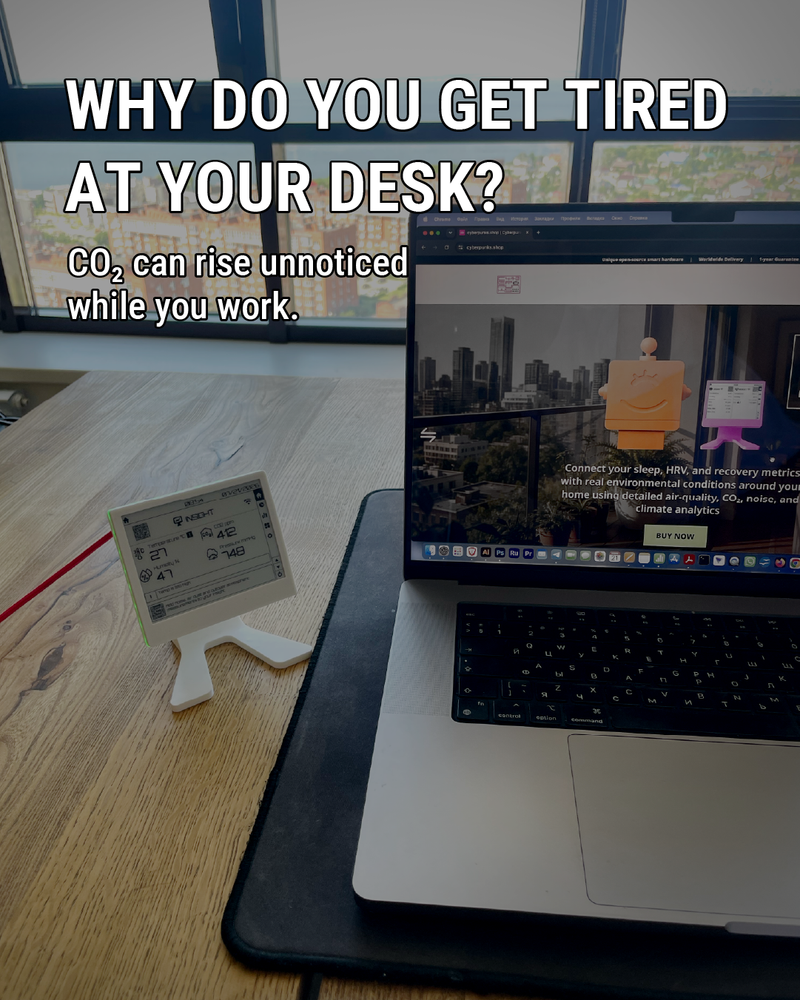
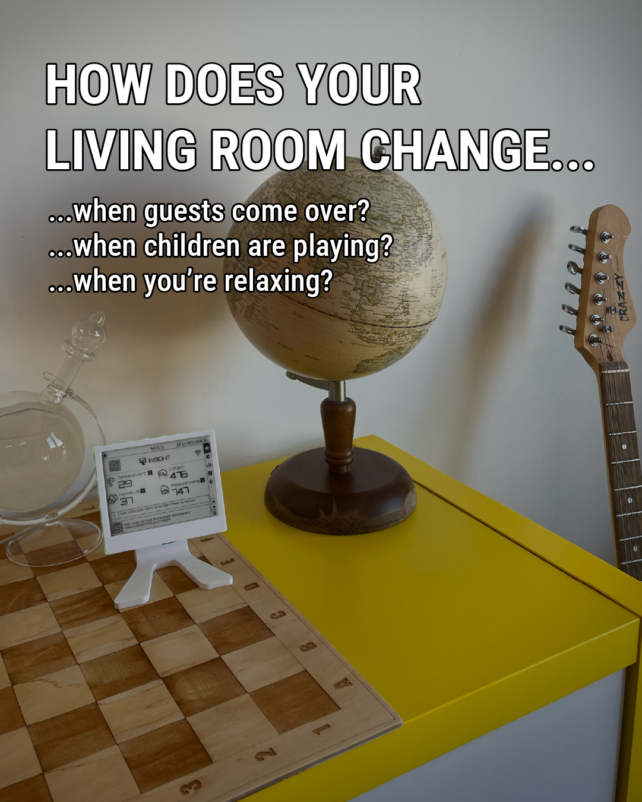
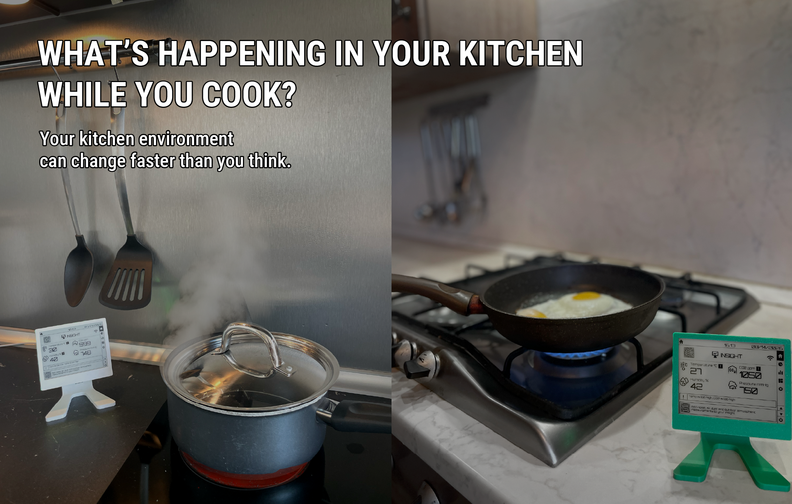
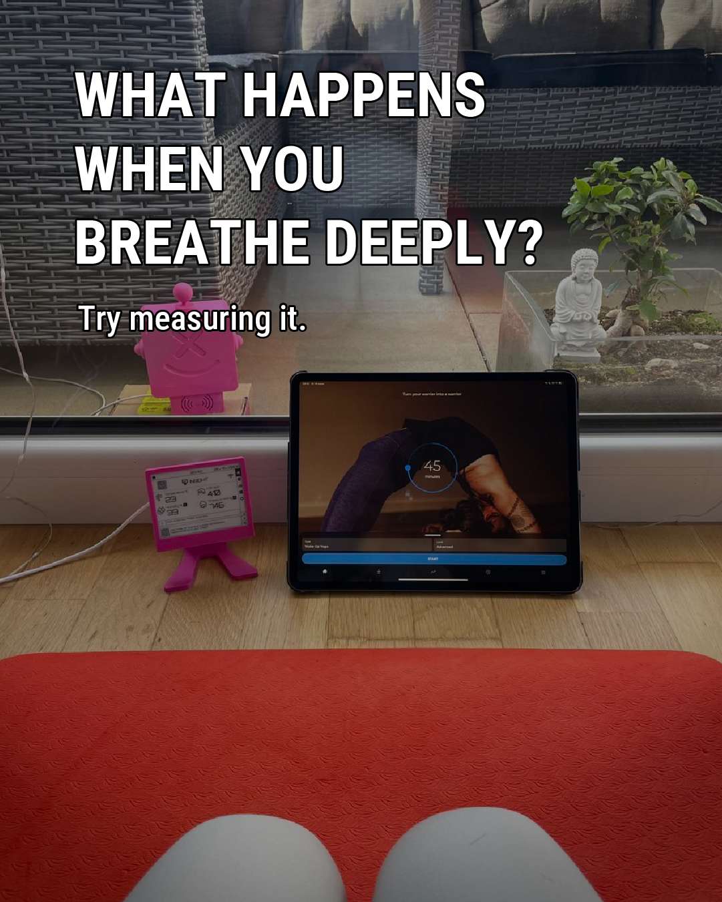
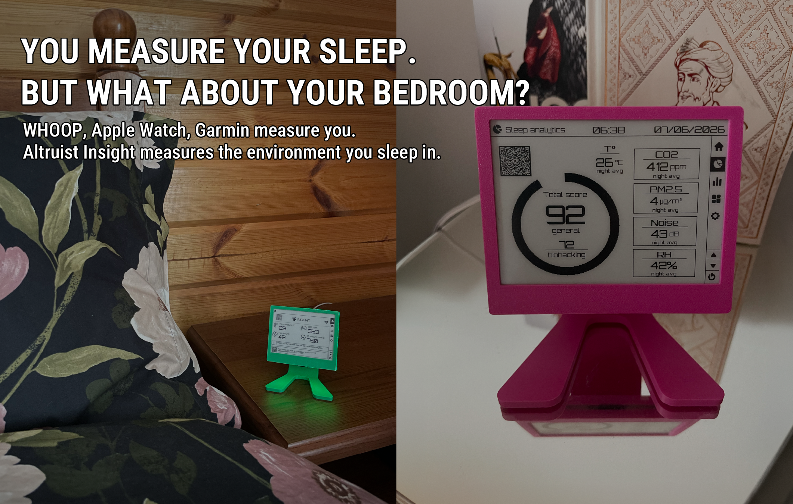
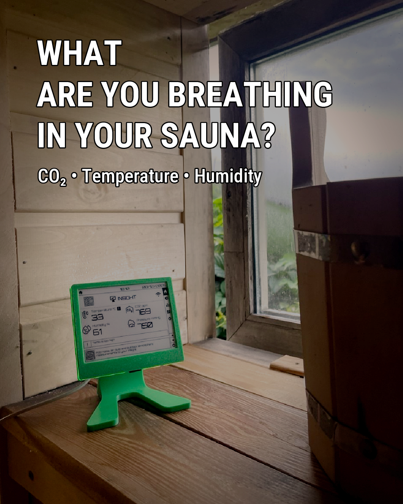

Мы проводим большую часть дня в помещении: спим, работаем, готовим еду, отдыхаем и занимаемся спортом. И все это время мы дышим. С каждым вдохом мы выдыхаем CO₂. Если в комнату не поступает достаточное количество свежего воздуха, его концентрация постепенно увеличивается.

Проблема в том, что **мы не можем сами почувствовать уровень CO₂**. Возможно, в воздухе нет неприятного запаха, в комнате не душно, и ничего вокруг нас не меняется. Вот тут на помощь приходит **Altruist Insight**: он непрерывно измеряет уровень CO₂ прямо в комнате, где вы находитесь, и выводит текущий уровень непосредственно на дисплей. Он также контролирует температуру и влажность, помогая видеть, как ваш внутренний климат изменяется в течение суток.

**Вместо того чтобы гадать, нужно ли проветрить помещение, вы просто смотрите на данные. Altruist Insight помогает превратить незаметные изменения в воздухе в то, что вы можете увидеть — и на что можете повлиять.**

## Часто достаточно просто открыть окно

Повышенное содержание CO₂ в помещении часто означает только одно: комнате нужен свежий воздух. **Altruist Insight** показывает, когда содержание CO₂ начинает расти и когда оно снова снижается после проветривания.

**Это особенно полезно зимой, когда вы не хотите сильно охлаждать комнату; в жаркую погоду, когда не хотите, чтобы в помещение проникало слишком много тепла; или в пыльный сезон и сезон пыльцы, когда не хотите оставлять окна открытыми дольше, чем это необходимо.** Вы можете проветривать тогда, когда это действительно нужно, и столько, сколько необходимо.

## Ваше рабочее пространство

Легко провести несколько часов за компьютером, не замечая, как меняется воздух вокруг вас. В закрытой комнате CO₂ постепенно накапливается, и повышенные уровни часто сигнализируют о недостаточной вентиляции. Это может быть связано с **сонливостью, усталостью, ощущением духоты и трудностями с концентрацией внимания**, а исследования также связывают вентиляцию и повышенные уровни CO₂ с изменениями в некоторых показателях когнитивной производительности.

**Altruist Insight** позволяет видеть уровень CO₂ прямо на вашем столе и замечать, когда комнате нужен свежий воздух. Иногда достаточно всего нескольких минут проветривания, чтобы обновить воздух и продолжить работу в более комфортных условиях.

## Гостиная: семья, дети и гости

Условия в вашей гостиной меняются в зависимости от количества людей в ней. Один человек, читающий книгу, — это одна ситуация. Вечер с всей семьей, детьми, друзьями или гостями — совсем другая. Чем больше людей находится в закрытой комнате, тем быстрее может увеличиться уровень CO₂.

Вот где мониторинг становится особенно полезным: вам не нужно ждать, пока все почувствуют, что в комнате душно. **Altruist Insight** показывает, как воздух меняется, и помогает понять, когда нужно проветривать помещение.

## Кухня: Во время готовки

Условия в кухне могут быстро изменяться. Приготовление пищи повышает температуру и влажность, а если вы используете **газовую плиту или духовку, сжигание газа потребляет кислород и производит CO₂**. В то же время, люди на кухне продолжают выдыхать CO₂. При недостаточной вентиляции концентрация может заметно увеличиться.

С **электрической или индукционной варочной панелью** ситуация иная: топливо в помещении не сжигается, поэтому сама плита CO₂ не производит. Однако CO₂ все же может повышаться во время готовки просто из-за того, что люди находятся в плохо проветриваемом помещении.

**Altruist Insight** позволяет контролировать **CO₂, температуру и влажность** во время готовки и увидеть, когда вашей кухне требуется свежий воздух.

## Упражнения и Йога

Во время **активных упражнений** мы дышим чаще и интенсивнее, поэтому CO₂ может повыситься быстрее в небольшом закрытом помещении, особенно при ограниченной вентиляции.

Во время **йоги и дыхательных практик** физическая нагрузка отличается, но само дыхание становится важной частью занятия. Глубокое, контролируемое дыхание и долгое пребывание в одном и том же помещении — веские причины обратить внимание на вентиляцию и свежий воздух.

Вы даже можете провести простой эксперимент с **Altruist Insight**: проверьте уровень CO₂ до, во время и после тренировки, затем откройте окно и посмотрите, как быстро изменяются показания.

## Спальня: Что мы не измеряем, пока спим?

Мы привыкли измерять свой сон. **WHOOP, Apple Watch, Garmin и другие носимые устройства** отслеживают длительность сна, частоту сердечных сокращений, HRV, дыхание, стадии сна и восстановление. Утром мы проверяем наш показатель восстановления или балл сна — и иногда задаемся вопросом, почему наше восстановление оказалось не таким хорошим, как ожидалось, даже после восьмичасового сна.

Но часы и фитнес-трекеры в основном измеряют **нас, а не окружающую среду, в которой мы спим**. Температура, влажность и вентиляция спальни также могут влиять на условия, в которых мы спим.

Мы проводим в одной комнате ночь за ночью по семь, восемь или даже девять часов. Если окна и дверь закрыты, CO₂ может постепенно накапливаться, пока мы спим. Это особенно трудно заметить, потому что мы просто не видим, что происходит с воздухом в течение ночи.

**Altruist Insight добавляет еще один уровень к вашим данным о сне — данные о вашей спальне.** Утром вы можете посмотреть, как менялись CO₂, температура и влажность в течение ночи, и сравнить эти условия с вашим сном и восстановлением. Причина неидеальной ночи может заключаться не только в том, как долго вы спали, но и **в условиях, в которых вы спали**.

Если Insight показывает, что CO₂ значительно увеличивается в течение ночи, вы можете использовать эту информацию для принятия решений — например, тщательно проветривать спальню перед сном, оставлять окно или дверь слегка открытыми на ночь, когда это возможно, или рассмотреть дополнительную вентиляцию, если высокие уровни случаются регулярно.

**Ваше носимое устройство измеряет вас. Altruist Insight измеряет комнату, в которой вы спите.**

### Аналитика сна: Вся ночь в одном отчете

Altruist Insight включает в себя специальную функцию **Аналитики сна**. В течение ночи устройство контролирует условия в вашей спальне и генерирует **Ночной отчет и Балл комфорта** утром. Анализ включает CO₂, температуру и влажность, а при подключении Altruist Urban также можно учитывать PM2.5 и пиковый уровень шума ночью. Существуют два режима оценки: стандартный и более строгий режим **Биохакинг**.

Это не оценка стадий сна или медицинская оценка качества сна. Аналитика сна показывает, **насколько комфортной была среда, в которой вы спали**.

Узнайте больше о том, как работают Ночный отчет и Балл комфорта:

[Insight Sleep Analytics: Как работает ночной отчёт и оценка комфорта](/blog/insight-sleeping-analytics)

## Дополнительный случай: Зона отдыха домашней сауны

Если у вас есть **частная сауна с отдельной зоной отдыха дома**, Altruist Insight может быть полезен и там. Речь идет не о размещении устройства внутри горячей кабины сауны, а в комнате, где вы отдыхаете и охлаждаетесь между заходами в сауну.

Вы можете проводить довольно много времени в зоне отдыха, особенно если у вас несколько подходов к сауне. Если комната закрыта или несколько человек отдыхают там вместе, CO₂ может постепенно увеличиваться. **Altruist Insight** позволяет вам контролировать **CO₂, температуру и влажность**, видеть, когда зона отдыха нуждается в свежем воздухе, и наблюдать за эффектом вентиляции.

## Измеряйте вместо того, чтобы гадать

Вам не нужно становиться экспертом по качеству воздуха в помещении или постоянно думать о вентиляции. **Altruist Insight показывает вам уровень CO₂ там, где проходит ваша повседневная жизнь:** когда вы работаете, готовите, проводите время с семьей, занимаетесь спортом и спите — и даже в вашей домашней зоне отдыха, если она у вас есть.

И часто действие очень простое: **увидеть рост CO₂, открыть окно, наблюдать, как уровень падает, и снова закрыть окно.**

**Мы не чувствуем CO₂. Но мы можем его измерить.**
