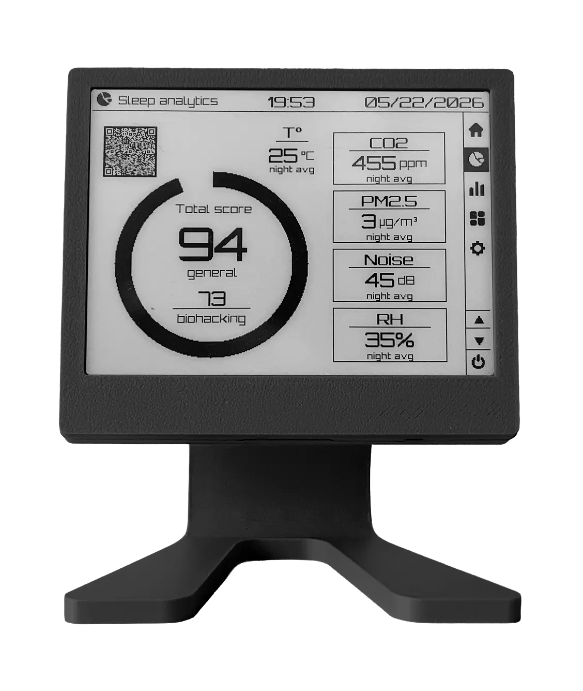
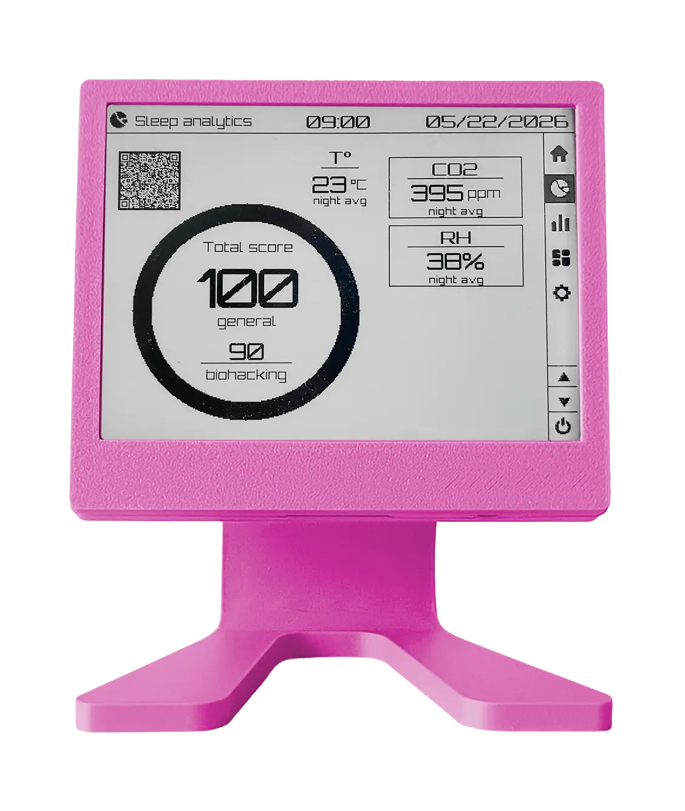
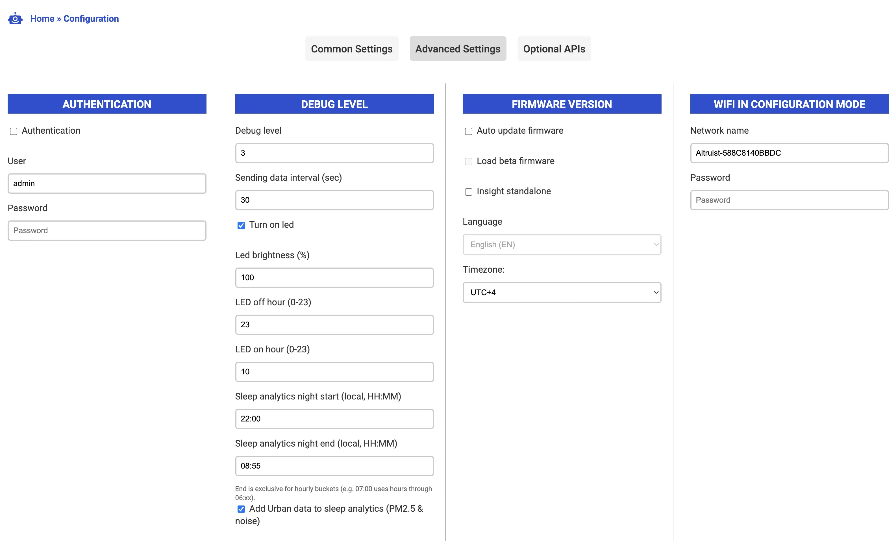

Окружающая среда в спальне меняется в течение ночи — часто незаметно. Insight Sleep Analytics превращает эти небольшие изменения в простой утренний отчёт о том, насколько комфортными были условия для сна.

Система оценивает:

- концентрацию CO₂
- температуру
- влажность
- PM2.5 (если доступно)
- уровень шума (если доступно)

В результате формируется **ночной отчёт** и **оценка комфорта**, отражающая общее качество условий во время сна.

> Оценка сна отражает комфорт среды, а не стадии сна и не медицинское качество сна.

---

## Ночной отчёт с первого взгляда

<div class=grid>




</div>

| Элемент          | Значение                                    |
| ---------------- | ------------------------------------------- |
| Большое кольцо   | Общая оценка комфорта (базовая модель)      |
| Биохакинг-оценка | Более строгая модель с жёсткими порогами    |
| Карточки метрик  | Средние значения за ночь по каждому датчику |

---

## Как собираются данные

Insight постоянно считывает данные с датчиков:

- температура
- влажность
- CO₂

Если включён Urban:

- PM2.5
- шум

Вместо хранения сырых данных система вычисляет почасовые средние значения, которые сохраняются в памяти устройства.

```mermaid id="flow1"
flowchart LR
    Sensors[Sensors] --> Hourly[Hourly averages]
    Hourly --> Storage[Local storage (~48h)]
    Storage --> Night[Night window]
    Night --> Score[Comfort Score]
```

SD-карта не требуется — все данные хранятся внутри устройства.

---

## Определение ночного окна

Настраивается в веб-интерфейсе:

- начало: 22:00
- конец: 07:00 (не включительно)

Это примерно 9 часов сна.

Особые случаи:

- начало = конец → 24/7 режим
- пересечение полуночи → данные объединяются автоматически

---

## Когда формируется отчёт

Отчёт создаётся только при достаточном количестве данных:

```id="rule1"
required_hours = ⌈2/3 × night_length⌉
```

Для 9 часов:

- минимум 6 часов данных

Если данных недостаточно:

> Night data is collecting

---

## Как считаются средние значения

1. Данные усредняются по часам
2. Берутся только часы внутри ночи
3. Рассчитывается среднее по каждой метрике

---

## Система оценки комфорта

Insight преобразует среду в оценку от 0 до 100.

Есть две модели:

### Общая

Мягкие пороги, для общего использования.

### Биохакинг

Строгие пороги для оптимизации среды.

---

Обе модели работают одинаково:

Оценка начинается с 100 (идеальные условия). Каждый параметр снижает её при отклонении от нормы.

**Score = 100 − суммарный дискомфорт**

```id="score1"
score = clamp(100 + 2 × Σ(impact), 0, 100)
```

---

## Как влияет каждый параметр

### CO₂

- 750 ppm (общая)
- 600 ppm (биохакинг)
- −0.52% / −0.80% на +100 ppm

### PM2.5

- 5 / 3 µg/m³
- −0.3% / −0.5% на +10 µg/m³

### Шум

- 35 / 30 dB
- −2.5% / −3.5% на +10 dB

### Температура

- 25°C / 20°C
- −1.5% на +1°C выше порога

### Влажность

- 40–60% / 40–50%
- −0.2% / −0.4% на отклонение

---

## Пример

CO₂ = 900 ppm:

- превышение: +150 ppm
- влияние ≈ −0.52 × 1.5 = −0.78%

Далее суммируется с другими параметрами.

100 = идеальные условия.

---

## Интерпретация оценок

- 90–100 → отлично
- 70–90 → хорошо
- 50–70 → средне
- <50 → плохо

---

## Настройки



- время начала и конца сна
- добавление/отключение Urban-датчиков

---

## Ограничения

- не измеряет стадии сна
- краткие пики сглаживаются
- первая ночь может быть неполной
- это индикатор среды, не медицина

---

## Итог

Insight Sleep Analytics превращает данные о среде в единый показатель комфорта на основе взвешенной модели.

Система продолжает развиваться и улучшаться.

Если вы используете Insight — ваш [feedback](https://github.com/airalab/altruist-firmware/issues) помогает развитию продукта.

Попробовать устройство: [Insight](https://cyberpunks.shop/altruist-insight)
