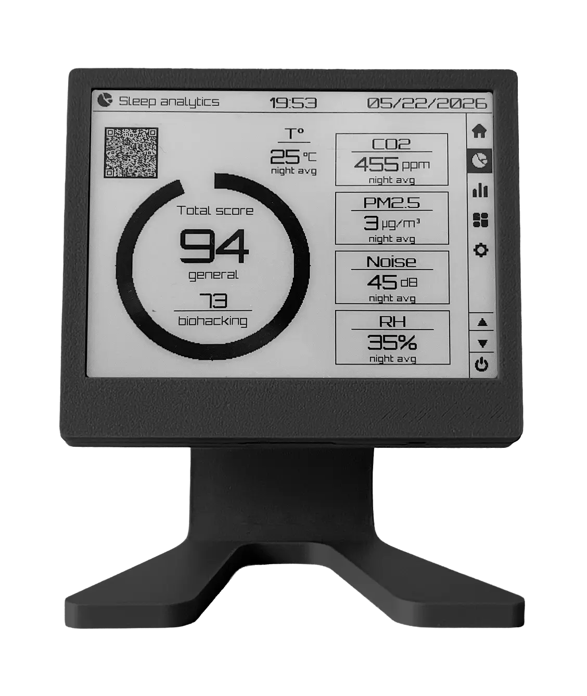
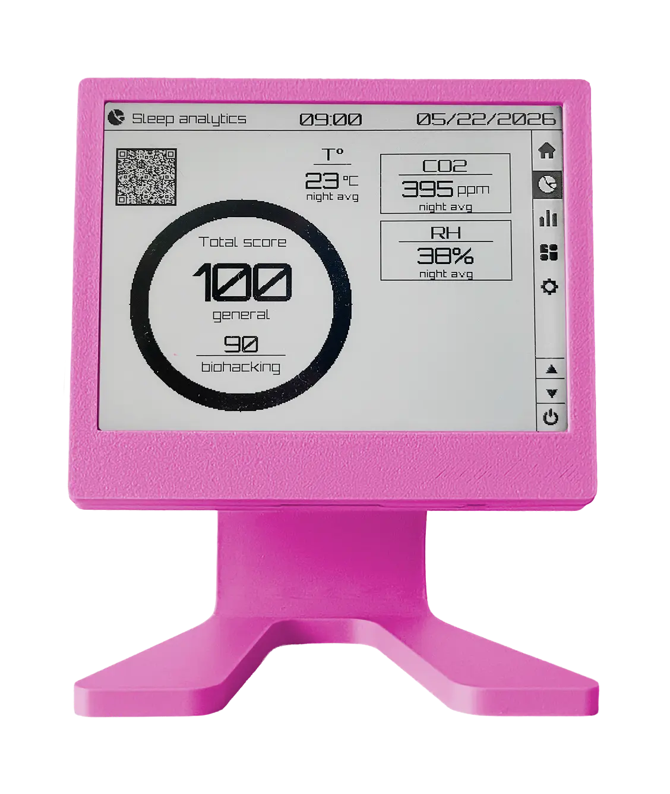
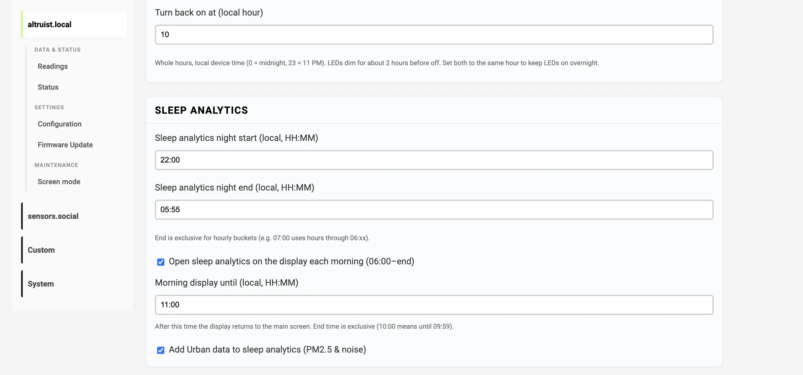

Окружающая среда в спальне меняется в течение ночи — часто незаметно. Insight Sleep Analytics превращает эти небольшие изменения в простой утренний отчёт о том, насколько комфортными были условия для сна.

Система оценивает:

- концентрацию CO₂
- температуру
- влажность
- PM2.5 (если доступно)
- пики шума (если доступно)

В результате формируется **ночной отчёт** и **оценка комфорта**, отражающая общее качество условий во время сна.

> Оценка сна отражает комфорт среды, а не стадии сна и не медицинское качество сна.

---

## Целевые диапазоны

| Метрика     | Общая модель              | Биохакинг               |
| ----------- | ------------------------- | ----------------------- |
| CO₂         | ≤ 750 ppm                 | ≤ 600 ppm               |
| Температура | 19–22°C                   | 17–20°C                 |
| Влажность   | 40–60%                    | 40–50%                  |
| PM2.5       | ≤ 5 µg/m³                 | ≤ 3 µg/m³               |
| Шум         | ≤ 5 часов с пиком > 45 дБ | ≤ 1 час с пиком > 45 дБ |

---

## Ночной отчёт с первого взгляда

<div class=grid>




</div>

| Элемент          | Значение                                          |
| ---------------- | ------------------------------------------------- |
| Большое кольцо   | Общая оценка комфорта (базовая модель)            |
| Биохакинг-оценка | Более строгая модель с жёсткими порогами          |
| Карточки метрик  | Итог за ночь (средние; шум — число пиковых часов) |

---

## Как собираются данные

Insight постоянно считывает данные с датчиков:

- температура
- влажность
- CO₂

Если включён Urban:

- PM2.5
- шум (`noiseAvg` / `noiseMax`)

Вместо хранения сырых данных система вычисляет почасовые средние (а для шума — ещё и **максимум** `noiseMax` за час), которые сохраняются в памяти устройства.

```mermaid id="flow1"
flowchart LR
    Sensors[Sensors] --> Hourly[Hourly averages / max]
    Hourly --> Storage[Local storage (~48h)]
    Storage --> Night[Night window]
    Night --> Score[Comfort Score]
```

SD-карта не требуется — все данные хранятся внутри устройства.

---

## Определение ночного окна

Настраивается в веб-интерфейсе:

- начало: 22:00
- конец: 07:00 (не включительно)

Это примерно 9 часов сна.

Особые случаи:

- начало = конец → 24/7 режим
- пересечение полуночи → данные объединяются автоматически

---

## Когда формируется отчёт

Отчёт создаётся только при достаточном количестве данных:

```id="rule1"
required_hours = ⌈2/3 × night_length⌉
```

Для 9 часов:

- минимум 6 часов данных

Если данных недостаточно:

> Night data is collecting

---

## Как считаются ночные значения

Для большинства метрик:

1. Данные усредняются по часам
2. Берутся только часы внутри ночи
3. Рассчитывается среднее по каждой метрике

Для **шума** считается число **пиковых часов**: час — пик, если максимум `noiseMax` за этот час **> 45 дБ**. На карточке показывается число таких часов (не средний дБ за ночь).

---

## Система оценки комфорта

Insight преобразует среду в оценку от 0 до 100.

Есть две модели:

### Общая

Мягкие пороги, для общего использования.

### Биохакинг

Строгие пороги для оптимизации среды.

---

Обе модели работают одинаково:

Оценка начинается с 100 (идеальные условия). Каждый параметр снижает её при отклонении от нормы.

**Score = 100 − суммарный дискомфорт**

```id="score1"
score = clamp(100 + 2 × Σ(impact), 0, 100)
```

---

## Как влияет каждый параметр

### CO₂

| Модель    | Порог   | Влияние            |
| --------- | ------- | ------------------ |
| Общая     | 750 ppm | −0.52% на +100 ppm |
| Биохакинг | 600 ppm | −0.80% на +100 ppm |

### PM2.5

| Модель    | Порог   | Влияние            |
| --------- | ------- | ------------------ |
| Общая     | 5 µg/m³ | −0.3% на +10 µg/m³ |
| Биохакинг | 3 µg/m³ | −0.5% на +10 µg/m³ |

### Шум (пиковые часы)

Оценивается не средний уровень за ночь, а **сколько часов** имели пик выше **45 дБ**.

| Модель    | Допуск (пиковых часов) | Влияние за каждый лишний пик |
| --------- | ---------------------- | ---------------------------- |
| Общая     | 5                      | −2.0%                        |
| Биохакинг | 1                      | −3.0%                        |

```id="noise1"
excess = max(0, peak_hours − allowance)
impact = −pct_per_peak × excess
```

### Температура

Учитываются и нижняя, и верхняя границы диапазона.

| Модель    | Диапазон | Влияние                          |
| --------- | -------- | -------------------------------- |
| Общая     | 19–22°C  | −1.5% за каждый °C вне диапазона |
| Биохакинг | 17–20°C  | −1.5% за каждый °C вне диапазона |

### Влажность

| Модель    | Диапазон | Влияние                    |
| --------- | -------- | -------------------------- |
| Общая     | 40–60%   | −0.2% за 10% вне диапазона |
| Биохакинг | 40–50%   | −0.4% за 10% вне диапазона |

---

## Пример

CO₂ = 900 ppm:

- превышение: +150 ppm
- влияние ≈ −0.52 × 1.5 = −0.78%

Далее суммируется с другими параметрами.

100 = идеальные условия (включая допуск по пикам шума).

---

## Интерпретация оценок

- 90–100 → отлично
- 70–90 → хорошо
- 50–70 → средне
- <50 → плохо

---

## Настройки



- время начала и конца сна
- добавление/отключение Urban-датчиков
- отключить открытие экрана анализа сна каждое утро

---

## Ограничения

- не измеряет стадии сна
- краткие пики сглаживаются в почасовых средних (температура, влажность, CO₂, PM2.5)
- шум считает почасовой максимум; короткий всплеск может дать пиковый час, если `noiseMax` > 45 дБ
- первая ночь может быть неполной
- это индикатор среды, не медицина

---

## Итог

Insight Sleep Analytics превращает данные о среде в единый показатель комфорта на основе взвешенной модели.

Система продолжает развиваться и улучшаться.

Если вы используете Insight — ваш [feedback](https://github.com/airalab/altruist-firmware/issues) помогает развитию продукта.

Попробовать устройство: [Insight](https://cyberpunks.shop/altruist-insight)
