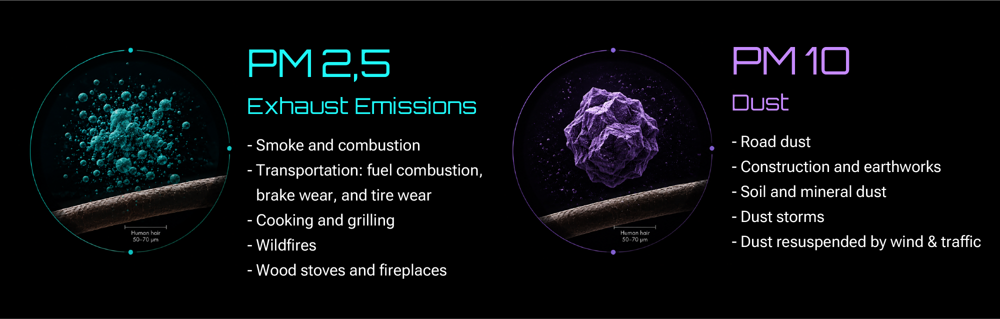
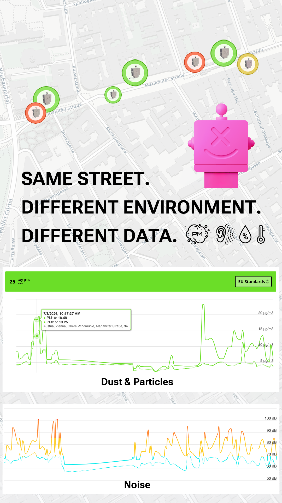
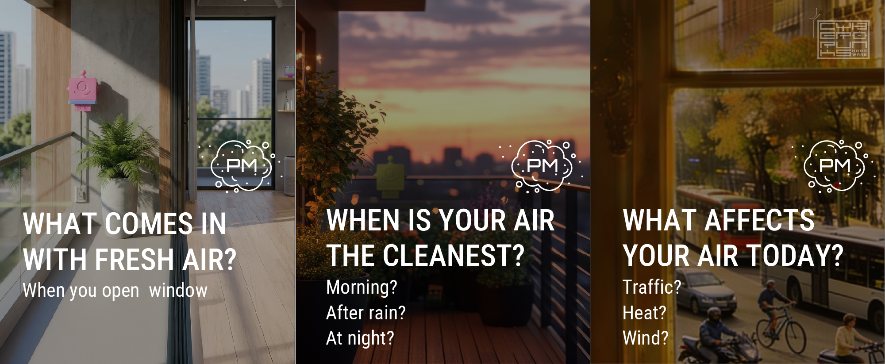
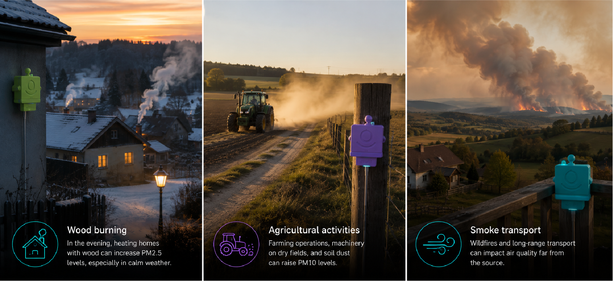
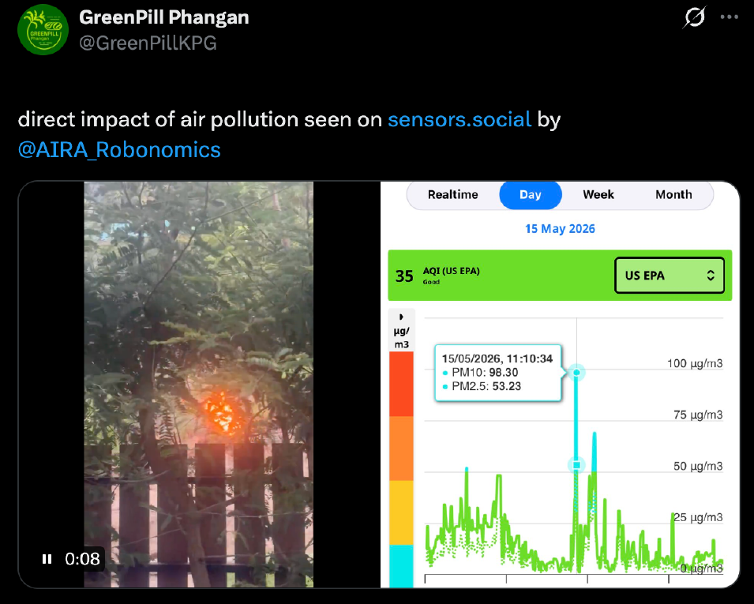
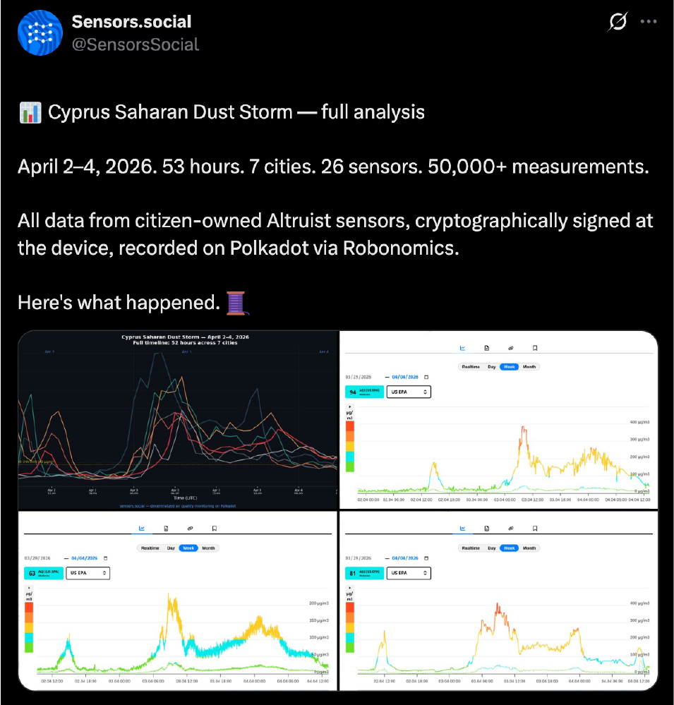
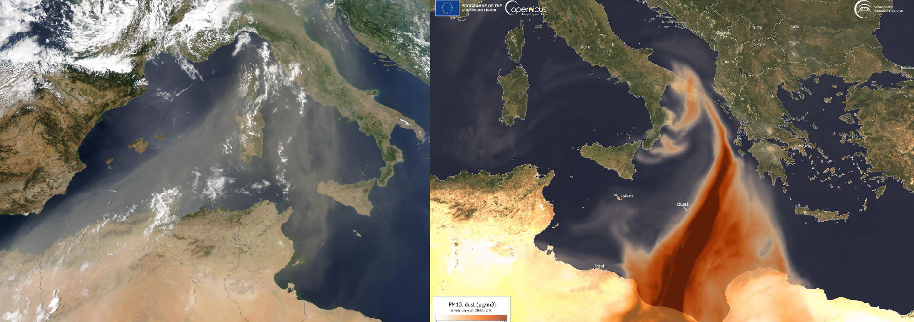

We often judge air quality by what we can see.

A busy road looks polluted. A construction site looks dusty. A park or a house in the countryside seems clean. If we see smoke, we assume the air quality is poor. If the sky is blue, everything seems fine.

But particulate pollution cannot always be seen or felt.

Particle concentrations can change significantly throughout the day, depend on wind and weather conditions, and vary even between neighboring streets. And the source of elevated levels is not always where we expect it to be.

That is why it is useful not just to make assumptions, but to measure PM2.5 and PM10 directly where we live, work, and spend our time.

## What Are PM2.5 and PM10?

**PM (Particulate Matter)** refers to tiny solid particles and liquid droplets suspended in the air.

The number next to PM indicates the aerodynamic size of the particles, not their origin or chemical composition.

### PM2.5

PM2.5 includes particles up to **2.5 micrometers** in diameter. They are most commonly produced by combustion processes or formed through chemical reactions in the atmosphere.

Typical sources include:

- smoke and combustion products;
- vehicle emissions (internal combustion engines), as well as brake and tire wear;
- wood stoves, fireplaces, and other heating systems;
- wildfires and vegetation fires;
- cooking over open flames or high-temperature frying, such as emissions from barbecue and grill restaurants;
- secondary aerosols — particles that form in the atmosphere when gaseous pollutants (such as nitrogen oxides, sulfur dioxide, or ammonia) undergo chemical reactions and are converted into fine particulate matter.

> A significant portion of PM2.5 is not emitted directly from a source but forms later in the atmosphere. This is why elevated PM2.5 levels can occur even in places where there are no obvious nearby pollution sources.

### PM10

**PM10** includes particles up to **10 micrometers** in diameter. These are generally larger particles produced by mechanical processes.

Typical sources include:

- road dust;
- construction dust and earthworks;
- soil and mineral dust;
- dust resuspended by wind or moving vehicles;
- dust storms;
- certain biological particles, such as large pollen grains.

> It is important to understand that the same pollution source can produce particles of different sizes. For example, traffic, wildfires, or construction activities may increase concentrations of both PM2.5 and PM10. Therefore, this classification is only a general guideline showing which particle sizes are more commonly associated with particular sources—it is not a strict rule.

For comparison, a human hair is typically 50–70 micrometers in diameter. PM10 particles are much smaller than a human hair, while PM2.5 particles are approximately 20–30 times smaller.

The smaller the particle, the deeper it can penetrate into the respiratory system. This is why the World Health Organization (WHO) considers long-term exposure to PM2.5 and PM10 to be an important health risk.

However, there is one important limitation. Measuring PM does not automatically identify what the particles are made of.

If a monitor detects elevated PM2.5 levels, it does not automatically mean the particles come from vehicle exhaust. Likewise, elevated PM10 does not necessarily indicate construction dust, pollen, or road dust.

A PM monitor measures the concentration of particles within a specific size range, but it cannot determine their chemical composition. To identify the most likely source, measurements should be interpreted together with local conditions, weather, wind direction, and nearby activities.

### PM2.5 and PM10 Show Different Sides of the Same Air

At first glance, it may seem that monitoring a single PM value is enough. In reality, comparing PM2.5 and PM10 together provides a much clearer picture of what is happening in your environment.

For example, construction work or strong winds often cause PM10 to rise more quickly because they generate larger dust particles. Wildfires, residential heating, and vehicle emissions tend to increase the concentration of finer PM2.5 particles. During dust storms, PM10 usually increases dramatically, although some of the mineral dust is also present in the smaller PM2.5 fraction.

However, the real world is rarely that simple. Multiple pollution sources can affect the same location at the same time, while wind may carry particles from the next street, another part of the city, or even another country.

That is why the most valuable insights come not from a single measurement, but from observing changes over time and comparing different locations. By tracking PM2.5 and PM10 together, it becomes much easier to recognize patterns, understand how your local environment changes, and make more informed decisions based on real data rather than assumptions.

## One Street. One Day. Different Data.

During one of our experiments with Altruist Urban, we carried out mobile air quality measurements across different parts of Vienna.

Our route passed through several distinct microenvironments: busy streets with trucks and public transport, quieter sections of the city, and active construction sites.

Before taking measurements, it's easy to make assumptions.
Trucks? Air pollution should increase.

Construction site? PM levels must be high.

Quiet street? The air should be cleaner.

But real-world measurements don't always match what we expect to see.
PM concentrations depend on much more than the most obvious source nearby. Wind, pollution intensity, humidity, traffic conditions, resuspended road dust, the surrounding urban layout, and even what happened in that location some time earlier can all influence the measurements.

For example, construction equipment may be standing nearby but producing very little dust at that particular moment. Likewise, a truck that appears to be the most obvious pollution source may not produce the highest PM2.5 or PM10 peak.

On the other hand, elevated particle concentrations may appear where no obvious pollution source is visible at all.

That is exactly why measurement history is so valuable.

A single number shows the air quality at one specific moment.

**A graph reveals how your environment changes over time.**

<InstagramEmbed url="https://www.instagram.com/reel/DakvTk2AF09/?utm_source=ig_web_copy_link&igsh=MzRlODBiNWFlZA==" />

### Why Air Quality Can Change from One Street to Another

Official air quality monitoring stations play a vital role in assessing air pollution across a city or an entire region. But people don't live in an "average city." They live on a specific street, open the windows in their own home, walk familiar routes, and spend time in particular places.

Even within the same neighborhood, air quality can vary significantly. Traffic, wind, urban layout, local pollution sources, and particles carried from other areas all influence the air around us. For example, streets lined with tall buildings may experience reduced airflow. This phenomenon, known as the street canyon effect, can trap pollutants between buildings and change how they disperse compared to open spaces.
That is why measurements from the nearest official monitoring station may differ from the measurements on your own balcony. This is not a contradiction—they simply answer different questions. **Official monitoring stations show what's happening across the city. Local measurements show what's happening where you actually live.**

### Is the Air Always Cleaner Outside the City?

Not necessarily.

Rural areas usually have less traffic and fewer large industrial pollution sources. However, air quality can still be affected by other factors, including wood-burning stoves and fireplaces, agricultural activities, farm machinery operating on dry fields, dust from unpaved roads and dry soil, wildfires, seasonal vegetation burning where it occurs, and pollution transported from other regions.

This is especially noticeable during winter. A small village may look perfectly clean—surrounded by forests, with very little traffic and no industry. But in the evening, people begin heating their homes, and under calm weather conditions, fine particles can accumulate close to the ground.

**That is why rural areas do not always mean clean air. Just like in cities, the most reliable way to understand local air quality is through measurements.**

### Can PM Measurements Detect Wildfire Smoke?

Yes.

Smoke from wildfires and vegetation fires contains large amounts of fine particles, which is why PM2.5 is one of the primary indicators used to assess smoke-related air pollution.

One of the most important characteristics of wildfire smoke is that the source does not have to be nearby. Air masses can transport smoke hundreds or even thousands of kilometers, causing PM2.5 levels to rise even when there is no visible fire in the surrounding area.

The opposite can also happen—measurements may help detect a problem before it becomes obvious.

On Koh Phangan, one Altruist Urban monitor recorded a sudden increase in particle concentrations. The measurements displayed on the sensors.social map helped draw attention to the area, allowing a fire to be detected early and action to be taken before it spread further.

This is another example of why air quality cannot be judged by sight alone. Sometimes smoke is clearly visible, while at other times it becomes so diluted in the atmosphere that it is almost impossible to see—even though its presence is still detected by air quality measurements.

## Dust Storms: When the Source Is Thousands of Kilometers Away

One of the clearest examples of long-range air pollution transport is a dust storm.

In the spring of 2026, we monitored such an event in Cyprus using Altruist Urban. The dust episode lasted for approximately 53 hours, and during its peak, PM10 concentrations exceeded 300 µg/m³.

At the same time, indoor measurements—where air purifiers were in use—remained significantly lower than outdoor values. This clearly demonstrated how differently indoor and outdoor environments can behave during the same event.

But the most valuable insight came not from a single peak, but from the measurement history. The graph revealed the entire process: normal conditions → arrival of the dust cloud → gradual increase in particle concentrations → peak → return to normal levels.

So, what is actually in the air during a dust storm?

The primary component is mineral dust—tiny particles of soil and rock lifted into the atmosphere by strong winds. Contrary to the common image of large grains of sand, much of this dust is small enough to travel hundreds or even thousands of kilometers.

During these events, PM10 typically shows the largest increase, although finer particles also contribute to PM2.5 levels.

A PM monitor cannot identify the origin of individual particles. It cannot tell you, "This particle came from the Sahara." It simply measures the concentration of airborne particles within specific size ranges. To determine where a dust cloud originated, scientists combine PM measurements with satellite observations, weather data, and atmospheric transport models.

Dust events are far from being limited to deserts.

- Cyprus and the Eastern Mediterranean are regularly affected by air masses carrying mineral dust from North Africa and the Middle East.
- Southern Europe—including Spain, Italy, Greece, and other Mediterranean countries—periodically experiences episodes of Saharan dust transport.
- The UAE and Dubai are located in an arid region where desert dust is an important factor affecting air quality.
- North Africa, including the Sahara Desert, is one of the world's largest sources of atmospheric mineral dust.
- The Middle East also experiences frequent and sometimes severe dust events.
- In East Asia, dust from the Gobi and Taklamakan deserts can travel across China toward Korea and Japan.
- Similar events also occur in arid regions of Australia and North America.

For people living in these regions, PM measurements have a very practical purpose. They help answer much more than the simple question, "Is it dusty today?"

Measurement history can reveal:

When did the event begin?

- How high did PM concentrations rise?
- When did they start to decline?
- How did indoor air compare to outdoor air throughout the event?
- When was it safe to open the windows again?

This is why measurement history is often far more valuable than a single PM reading. It helps reveal the full story of an environmental event, rather than just capturing one moment in time.

## Weather Can Change Everything

Even when the source of pollution remains the same, air quality measurements can look very different from one day to the next.
The main reason is the atmosphere.

Wind can quickly disperse local pollution, making the air noticeably cleaner. But the same wind can also carry wildfire smoke, industrial emissions, or mineral dust from distant regions.

Rain helps remove airborne particles from the atmosphere, which is why PM concentrations often decrease after rainfall. In contrast, prolonged dry weather promotes the accumulation and resuspension of dust from roads, construction sites, and other exposed surfaces.

Another important factor is a temperature inversion. Under normal conditions, warm air near the surface rises, allowing pollutants to disperse. During an inversion, a layer of warmer air sits above cooler air near the ground, acting like a lid that prevents vertical air mixing. As a result, pollutants can accumulate close to the surface even when local emissions have not significantly changed.

That is why the question: **_"Why are PM levels high today if nothing nearby has changed?"_** does not always have a local answer.

Sometimes the source is on the next street.

Sometimes it is outside the city.

And sometimes it is thousands of kilometers away.

**This is why PM measurements become far more meaningful when viewed together with weather conditions and measurement history, rather than as a single number on a screen.**

## What Should You Do When PM Levels Are Elevated?

An elevated PM reading does not always mean that the situation is dangerous. Before drawing conclusions, it is important to consider the data in a broader context.

First, check whether the increase is a short-lived peak or whether particle concentrations remain elevated for a longer period. Compare PM2.5 and PM10, review the measurement history, and examine how the values have changed over the past hours, days, or weeks.

Long-term monitoring can reveal patterns that are impossible to see from a single reading. Comparing data across a week, month, or even a year can help identify recurring trends, seasonal changes, and the effects of specific environmental events.

The sensors.social platform stores measurement history and allows you to follow environmental changes over time. Instead of seeing only the current value, you can explore graphs, compare different periods, and better understand how air quality changes in your area.

It is also important to consider what is happening nearby. Construction work, heavy traffic, or other local events may be contributing to elevated particle levels. However, the cause may also be a larger regional event, such as wildfire smoke, a dust storm, or pollution transported from another area. This is why it can be useful to compare your own measurements with weather conditions, satellite observations, and official air quality information.

When outdoor PM levels are significantly elevated, it may be reasonable to reduce the amount of polluted outdoor air entering the building during the peak and choose a more suitable time for ventilation. Effective indoor air filtration can also substantially reduce particle concentrations inside.

During serious pollution events, such as wildfire smoke or a severe dust storm, official public health guidance should also be taken into account, especially when planning prolonged or intense physical activity outdoors.

But this raises another important question: **When is it safe to open the windows again?**

This is where comparing the outdoor and indoor environments at the same time becomes especially useful.

An outdoor monitor shows what is happening outside the building.

An indoor monitor shows how those changes affect the space where you spend most of your time.

This is the purpose of Altruist Dual, a system that combines Altruist Urban for outdoor monitoring with Altruist Insight for indoor monitoring. By comparing data from both devices, you can make better-informed decisions about when to ventilate, when to use an air purifier, and when to adjust indoor humidity or other environmental conditions.

**Together, outdoor and indoor measurements—supported by long-term data history on sensors.social—help you make decisions based on real conditions rather than assumptions.**

## What PM Monitoring Can — and Cannot Tell You

PM monitoring shows how many airborne particles of different size fractions are present, how their concentrations change over time, and how air quality differs from one location to another.

However, a PM monitor cannot identify the chemical composition of particles or determine their exact source.

For example, elevated PM10 levels near a construction site may be caused by construction dust, while increased PM2.5 may be associated with wildfire smoke. But PM measurements alone cannot confirm either.

To interpret the data correctly, it is important to consider location, time, weather conditions, and other environmental information.

This is when individual measurements become a real understanding of the environment around you.

## Stop Guessing. Start Measuring.

We constantly make assumptions about the air around us. A construction site looks dusty, a passing truck seems like an obvious source of pollution, a park feels clean, and the countryside is often assumed to have better air than the city. Even a clear blue sky is commonly seen as a sign of good air quality.

But the environment is far more complex than our impressions. Most airborne particles are invisible, they can travel hundreds or even thousands of kilometers with changing air masses, and their concentrations can vary significantly throughout the day. The source of pollution may be nearby, on the next street, outside the city, or even in another country. As a result, real measurements often reveal something very different from what we expect.

Altruist Urban measures PM2.5 and PM10 exactly where you live, work, walk, or explore your city. Measurements are stored on sensors.social, allowing you to view historical data, compare days, weeks, months, or even years, and identify long-term patterns that cannot be seen from a single reading.

So the real question is no longer: **_"What is the air quality in my city?"_**

A more useful question is: **"What is happening to the air right here, right now—and how is it changing over time?"**
