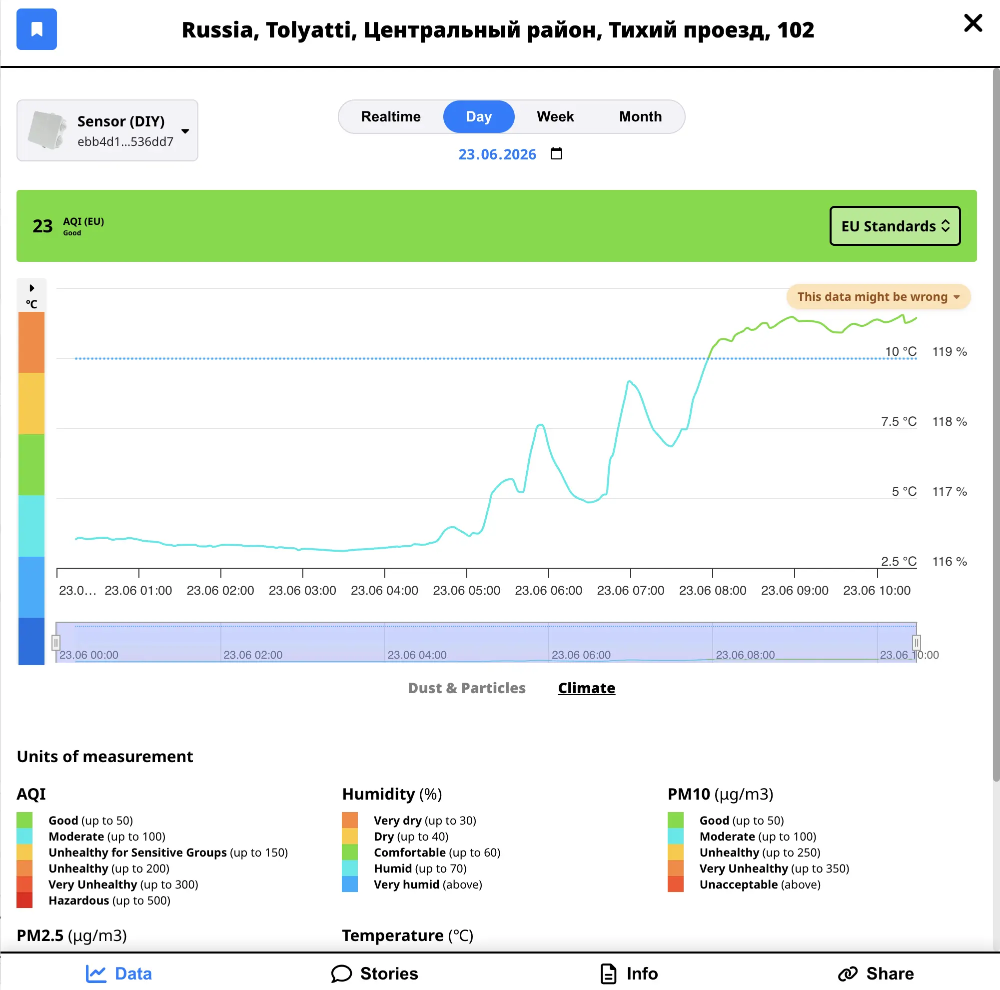
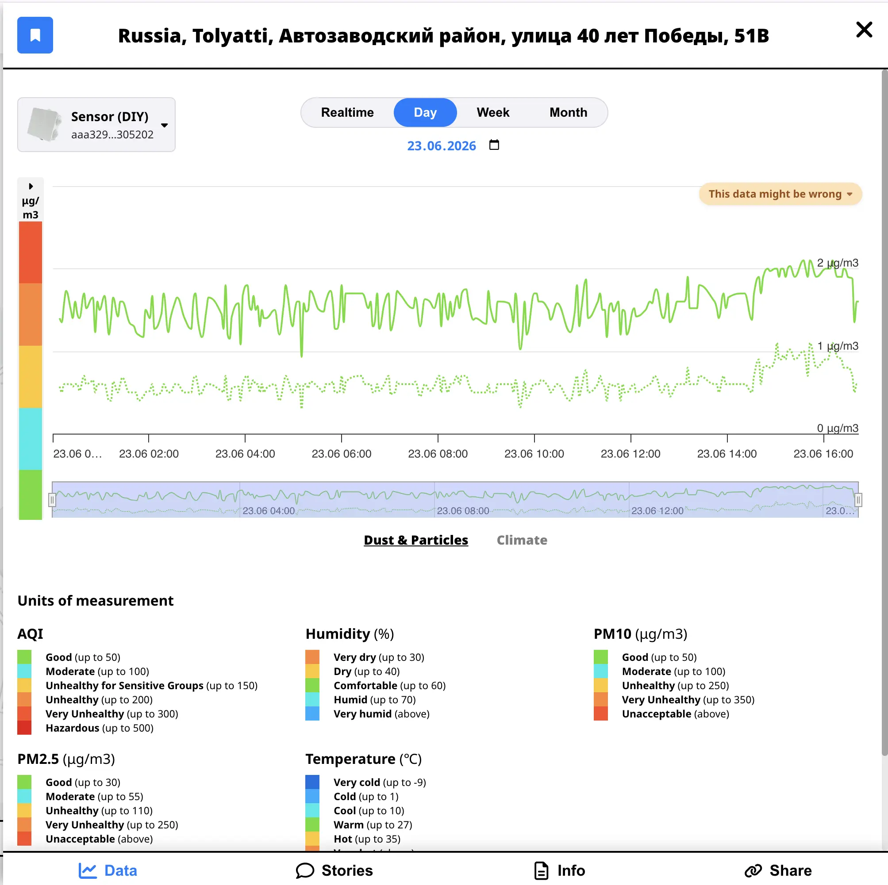
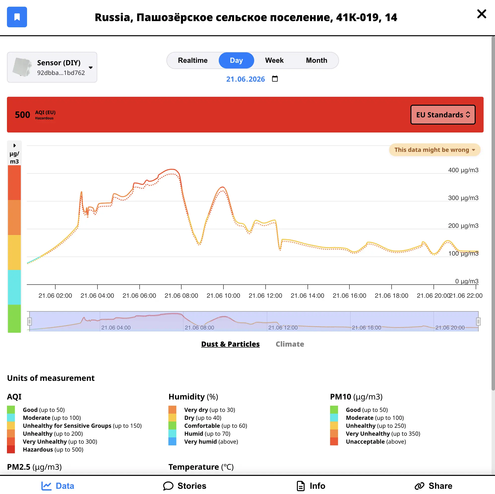

Не каждый маркер на [sensors.social](https://sensors.social) говорит правду.

Чаще всего гражданские датчики ведут себя как ожидается: дышат вместе с погодой, реагируют на машины, всплескивают, когда кто-то жжёт листья в соседнем дворе. Но датчик — вещь физическая. Он намокает, забивается пылью, смещается, начинает плыть. И тогда карта всё равно может показать цифру — очень уверенную на вид — которая с реальностью не совпадает.

Предупреждение на графике — не упрек. Скорее друг, который тихонько трогает вас за плечо: _«Эй, может, глянь на этот ещё раз»._

---

## Что видно на карте и что происходит на самом деле

В режиме **Ежедневная сводка** у каждого датчика на карте — **максимум за день** по тому, что вы смотрите: PM10, температура, шум и так далее. Одна цифра, один цвет, удобно пробежаться глазами.

Но одного дневного максимума мало. Датчик пыли может весь день отчитывать «2 мкг/м³» — формально валидная цифра, формально максимум — и при этом не реагировать ни на проезжающую машину, ни на строительную пыль, ни на ветер. Температура может чуть шевелиться, а влажность сутки напролёт сидит на 119%.

Поэтому предупреждение смотрит на **всю историю на графике**, а не только на максимум на маркере.

---

## Как мы понимаем, что что-то не так

Когда вы в **Ежедневной сводке** открываете график датчика, карта в фоне прогоняет небольшую **проверку качества** — застывшие линии, невозможная влажность, пыль, которая едва шевелится. То, на что сами бы косились глазом, если бы смотрели график пару минут.

### Когда срабатывают проверки

Wathcdog просыпается только в **Ежедневной сводке** (не в режиме онлайн). Когда вы кликаете датчик и смотрите график, мы берём все показания за выбранный период — день, неделю или месяц — и разбираем их **по календарным суткам**.

У каждого дня своя отметка «норма / подозрительно». Если вы смотрите неделю и _хотя бы один_ день в ней выглядит странно по PM, климату или шуму, предупреждение может появиться на этой вкладке. В бейдже указаны конкретные метрики — PM10, влажность, средний шум и т.д.

Результаты кешируются в браузере, чтобы не пересчитывать одну и ту же историю при каждом клике. Данные за сегодня перепроверяются по мере поступления новых замеров.

### На что смотрим

Всё делится на три группы. Датчик может «провалиться» по одной, двум или всем трём независимо.

**Воздух (PM10 и PM2.5)**

- **Застывшие показания пыли** — значения едва двигаются весь день. Реальная пыль меняется от трафика, ветра и активности людей; ровная линия обычно значит, что датчик перестал улавливать реальные изменения в воздухе.
- **Залипание около нуля** — PM10 или PM2.5 часами показывают почти ничего (меньше 1 мкг/м³). Часто это мёртвый или забитый датчик.
- **Дикие повторяющиеся скачки** — график снова и снова прыгает от низкого к высокому и держится на повышенном PM большую часть дня. Несколько всплесков от костра или от того, что рядом курили, — нормально; «американские горки» целый день на городских уровнях — нет.
- **PM2.5 выше PM10** — PM2.5 не может быть выше PM10.
- **Странное соотношение PM2.5 / PM10** — два измерения рассказывают противоречивые истории, что не похоже на обычное поведение частиц.

**Климат (температура и влажность)**

- **Влажность выше 100%** — или одно и то же невозможное значение весь день. 119% — однозначно неисправность датчика.
- **Влажность 100% больше 8 часов подряд** — даже ровно 100% редко держится весь день на улице без дождя или тумана прямо на датчике.
- **Температура и влажность застыли вместе** — обе линии идеально ровные, хотя погода вокруг явно меняется.
- **Влажность прыгает дико** — резкие скачки (60 → 20 → 65 → 25), не похожие на реальную погоду.

**Шум (средний и максимум)**

- **Средний и максимум склеились** — пик почти всегда громче среднего. Если оба показания днями считывают одно число, микрофон, скорее всего, сломан.
- **Рёв или ровная тишина** — шум застрял на 80+ дБ без вариаций или около нуля там, где вокруг явно есть жизнь.

### Чего мы не делаем

Карта **не удаляет, не прячет и не переписывает** показания. Все значения остаются на карте и в истории ровно такими, как их прислал датчик. Жёлтый бейдж — только подсказка на графике, для выбранной вкладки и дат.

Мы не ищем одно неудачное измерение. Несколько всплесков от костра или сигарет тревогу не включат; влажность, застывшая на 119% целый день, — включит.

Совсем новые датчики получают короткий период «прогрева», чтобы свежая установка не помечалась сразу после включения.

Цель не в идеале. Цель — поймать случаи, где _форма_ данных — застряла, невозможна или скачет — говорит, что устройству нужно внимание, даже если маркер на карте выглядит нормально.

---

## Когда одного маркера мало

Три паттерна на карте прямо сейчас. В одном влажность делает невозможные вещи июньским днём. В другом показания пыли застыли у пола — в Тольятти и на побережье Кипра. В третьем маркер краснеет от всплеска загрязнения, который рассыпается, стоит открыть график за неделю.

Одна карта, один дневной максимум на маркере — и три совершенно разных способа, как данные перестают иметь смысл, когда прокручиваешь график.

### Пример 1: летний день, как зимой

**[Открыть этот датчик на карте →](https://sensors.social/?type=temperature&date=2026-06-23&provider=remote&lat=53.530827&lng=49.397467&zoom=18&sensor=ebb4d12c2004c2c0e19f7ff93f5414fbd7d44a8e1a8decc91bd1dd6a88536dd7)**

Этот стоит под Тольятти. 23 июня 2026 года на улице было в основном **от 3 до 12 °C**.

В конце июня в этом уголке Поволжья обычно гораздо теплее. Линия температуры уже настораживает — но главная улика влажность: **около 119%** весь день.

Влажность не может быть выше 100% — это жёсткий предел того, сколько влаги держит воздух. Ровные 119% — не экстремальная погода, а проблема датчика: влага внутри корпуса, повреждённый элемент или установка, сместившаяся после ремонта.

Откройте вкладку **климат** на графике — должен появиться бейдж с **влажностью**, возможно и с температурой, но влажность — главный признак. На карте маркер может выглядеть просто странно; график говорит, что датчик сломан.

### Пример 2: самый чистый воздух на Земле (наверное, нет)

**[Открыть этот датчик на карте →](https://sensors.social/?type=pm10&date=2026-06-23&provider=remote&lat=53.5273&lng=49.3347&zoom=18&sensor=aaa329443b7e9dc71a9a72eaff663f0e529869b198e62ec2ac1a1bcee4305202)**

23 июня PM10 почти не двигался: в основном **от 1 до 2 мкг/м³**, PM2.5 ещё ниже.

В хороший день в городе PM10 может часами оставаться **ниже 20 мкг/м³** — это нормально. Нас цепляет не низкая цифра сама по себе, а линия, которая **едва шевелится**: ~1 мкг/м³, замер за замером, почти одинаково. Реальный воздух на улице чуть меняется от машин, ветра и погоды даже в спокойный день. Ровная линия на таком уровне обычно значит, что датчик перестал улавливать реальную пыль, а не что вы нашли самый чистый квартал на планете.

На графике классический **застрявший след пыли**: маленькие вежливые цифры, замер за замером почти одно и то же. Устройство онлайн и шлёт данные. Просто больше не «дышит» реальным воздухом.

Мы уже знаем почему: забилась воздухозаборная трубка. Датчик в **оконном креплении**, и вытащить или заменить трубку — риск треснуть всё стекло. Пока подозрительные данные лучше, чем разбитая рама.

В открытых картах датчиков маркер не знает ваших жизненных обстоятельств. Он знает только то, что до него доходит. Забитая трубка выглядит как кристально чистый воздух. Бейдж здесь как раз про это — «похоже, это неправда», пока кто-то не починит.

На карте маркер может быть ободряюще зелёным. Откройте график — история другая.

**[Та же история, другой маркер →](https://sensors.social/?type=pm10&date=2026-06-20&provider=remote&lat=53.5562&lng=49.2147&zoom=18&sensor=217a9ae639e48a9b99de7895c496b224ad6a80f9b679d516557561aedd47c58b)**

В нескольких километрах в Тольятти другой датчик день за днём держится на **1–3 мкг/м³** PM10 — та же плоская, едва движущаяся линия **20 июня** и в другие дни. Другое устройство, другая крыша. Не обязательно знать владельца или предысторию, чтобы заметить: реальный воздух он, похоже, уже не читает.

**[Тот же паттерн, побережье Кипра →](https://sensors.social/?type=pm10&date=2026-06-24&provider=remote&lat=34.9189&lng=32.9354&zoom=18&owner=4HDCXnm1YipFFogRG5kBuwrbhtoWTXGB9iZ2ao7vBaHQ16wu&sensor=4GUpWcu47FVZ7aH4JYiM8sJkbRhhrAErHphDm2mvtwubXViS)**

**24 июня** датчик у **Пафоса** пошёл ещё дальше: PM10 и PM2.5 сутки напролёт **0,0–0,2 мкг/м³** — **больше 330 замеров**, по сути ноль. Устройство онлайн и исправно шлёт данные. Показания пыли — нет. Это паттерн **залипания около нуля** без прикрас, а не чистый воздух.

### Пример 3: 415 на карте, хаос на графике

**[Открыть этот датчик на карте →](https://sensors.social/?type=pm10&date=2026-06-21&provider=remote&lat=60.1993&lng=34.6553&zoom=18&sensor=92dbba3c0640b2ac7f989acbbf02b3b227ff70f8059c0bc87c800bf4811bd762)**

Этот — в Карелии, у Ладоги. 21 июня 2026 года датчик записал десятки замеров — но какой график получился.

PM10 в тот день улетел до **415 мкг/м³**, PM2.5 шёл почти вровень. На карте дневной максимум красит маркер тревожным цветом — как будто было серьёзное загрязнение.

Присмотритесь к форме — не похоже на дым, пыль или трафик. Реальные события обычно нарастают и спадают. Здесь высокое и низкое **весь день** — в основном выше **80 мкг/м³**, не один короткий всплеск — скорее плохой контакт, чем меняющееся небо.

Откройте **целую неделю** — не лучше: влажность **119%** каждый день, когда датчик был онлайн (вкладка **климат**), PM катается с тихого на страшное (всплески выше 400 мкг/м³ 16, 20 и 21 июня — вкладка **PM**), и два тихих дня посередине, когда почти ничего не приходило. Переключитесь на неделю: если хоть один день в окне выглядит сломанным, предупреждение может появиться. Это не один неудачный полдень — устройству нужна помощь.

Та же улика по влажности, что в примере 1. Одно сломанное климатическое измерение уже подозрительно. В паре с PM, который всю неделю делает гимнастику, картина ясна: проверьте железо, не пишите заголовок про токсичный воздух.

Поэтому мы и зовём открыть график. Иногда бешеный датчик выглядит **слишком чисто** (пример 2). Иногда **слишком страшно** (этот). Иногда влажность просто невозможна, а остальное почти нормально (пример 1). Бейдж существует для всех этих случаев.

---

## Что делать, если видите бейдж?

Если это **ваш** датчик:

1. **Проверьте базовое** — укрыт ли прибор от прямого дождя? Чист ли воздухозабор? Не меняли ли что-то после переноса или ремонта?
2. **Смотрите график, а не только маркер** — один максимум может выглядеть нормально, а суточный узор — явно сломанным.
3. **Напишите нам** — если застряли, [поддержка](https://sensors.social/support/) поможет с настройкой и диагностикой.

Если это **чужой** датчик — воспринимайте как напоминание: открытые данные честны, в том числе в плохие дни. Один сбойный датчик не портит сеть; он показывает, зачем нужна прозрачность.

---

## Зачем вообще показывать плохие данные?

Можно было бы прятать подозрительные датчики. Некоторые платформы так делают. Но пропавший маркер и неверный маркер — разные истории. Пропажа — это тишина. Неверный маркер с предупреждением говорит: _этому устройству нужно внимание_, а история замеров остаётся для разбора.

Цель sensors.social — не идеально гладкая карта, а **надёжная**: где видно среду, можно отслеживать загрязнение в своём районе и при необходимости вернуться к сырым измерениям, когда случилось что-то интересное — или сломалось.

В следующий раз, когда маркер выглядит слишком хорошо, слишком плохо или просто чуть странно — кликните. Прокрутите график. Если есть бейдж, вы уже знаете больше, чем мог бы сказать один цвет.
